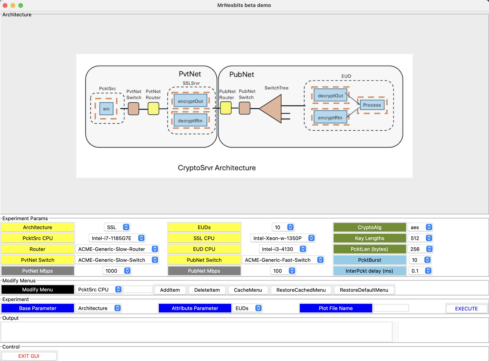
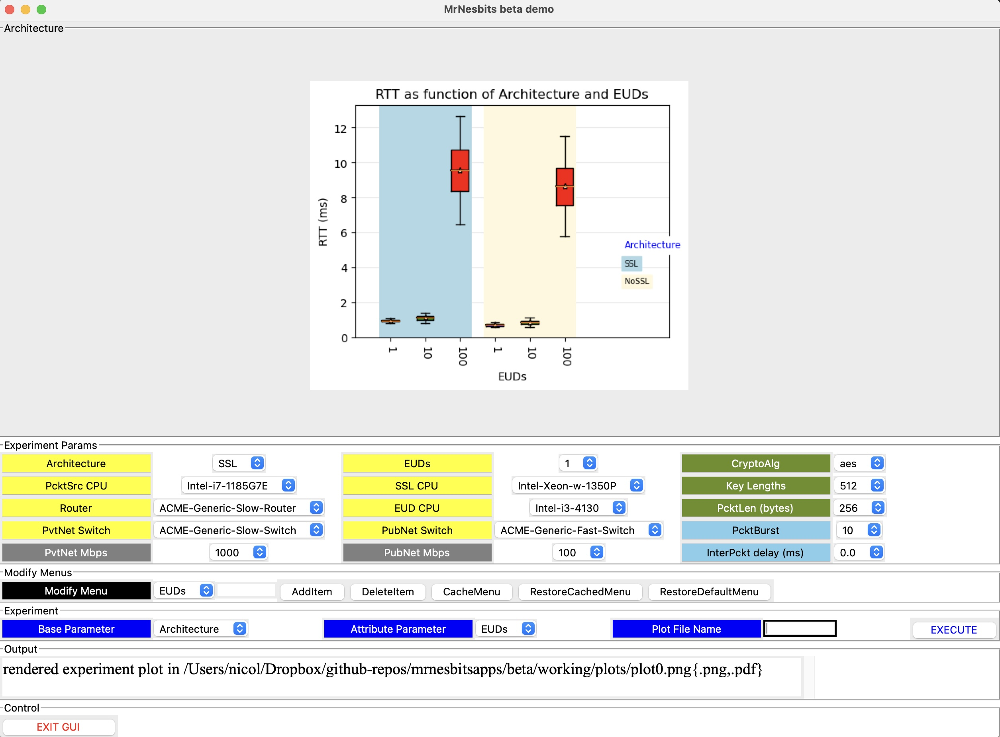

# MrNesbits beta release documentation
### Overview
The beta version of mrnesbits and its GUI focus on an application that generates messages for each of N External User Devices (EUDs). Each message is generated, encrypted, decrypted, and processed, with a response being generated, encrypted, decrypted, and recognized.  The simulation is focused on measuring the round-trip time (RRT) for this sequence, taken over all such messages. The model is constructed to give a user latitude in varying parameters that might significantly affect the RTT, and through the GUI to construct experiments that reveal such sensitivities.

### Modeled application
The application and user interface are most easily described through reference to a screen shot, see Figure 1. In the graphic at the top, dashed lines encompass application functions that are mapped to a processor, and the ensemble is labeled by the name the model uses to refer to the processor, e.g. ‘PcktSrc’.   The ‘EUD’ processor represents one instance of many such, each connected to the network labeled ‘SwitchTree’.    The ‘src’ application generates packets following a pattern that has three parameters, N, B, and m.  If there are N EUDs in the architecture, src cycles through N sessions, each session targeting an EUD, each EUD eventually being targeted by a session.   Within a session src generates B packets all targeting the same EUD.  Parameter m indicates that m units of time (or an exponentially distributed number of time units with mean m) elapse between successive packet initiations, within a session and between sessions.  The model does ascribe a simulation delay to the generation of a packet, but that is independent of inter-packet initiation.   If m=0 is chosen, then at the start of the simulation run all B*N messages involved are initiated at exactly the same time.  They then compete for limited CPU (and network) resources as they make their way through encryption and decryption functions and through the public network to their respective target EUDs.   There a packet is processed, and sent back to the src application.   The round-trip time (RTT) of each packet from time of initiation to time when its return to src is recognized is measured and becomes part of the result reported for the experiment.

						Figure 1: MrNesbits GUI at Start-up

### GUI Parameter Selection
Below the architecture graphic, in the ‘Experiment Params’ frame, we find 15 colored labels identifying a parameter, each label associated with a menu to its right.
Particularly relevant points are
* The user may choose between two architectures. In both there is a so-called “Private Network” (PvtNet) in which resides process called ‘PcktSrc’ that generates the packets. In both there is a Public Network (PubNet)  in which resides number of EUDs, and a tree of switches that connect them to the Public Network entry switch “PubNet Switch”.  In both architectures an application ‘src’ resident on host ‘PcktSrc’ generates a sequence of messages, addressing each to one of the EUDs, which as described earlier, processes it and returns a response to ‘src’.  Communication in both directions is encrypted. Where the two architectures differ is in the device used to perform the encryption and decryption tasks.  The architecture shown above has a dedicated device called the ‘SSLSrvr’ in the PvtNet that performs the encryption on messages leaving ‘src’, and decryption on messages returning to it.  The other architecture encapsulates the encryption and decryption within the same CPU as generates the messages.  It correspondingly does not have an SSLSrver device, nor a PubNet router.  The PvtNet Router connects directly to the PubNet switch.  The presence of both architectures was requested so that the performance impact of crypto function placement within the architecture might be assessed.
* The GUI has fifteen labels and adjoining menus in the ‘Experiment Params’ frame. Section  ‘Experiment Parameters’ below itemizes these, but suffice to say at this level that each defines a value for some particular input parameter to a simulation run, and that by choosing different values via the menus, one may expect some difference in the RRT statistics that result from corresponding simulation runs.  Parameters we understand to be of particular interest are (a) the architecture, (b) the number of EUDs in the architecture, (c) choice of cryptographic algorithm, (d) the length of the key used by that algorithm, and (e) the packetize (i.e. block size for streaming encryption).
* The ‘Modify Menus’ frame has a menu whose elements are names of menus in the ‘Experiment Params’ frame, a user input box,  and five function buttons.  This frame is included to aid a user in defining and selecting experimental parameters that do not appear by default when the GUI is run.   A user selects the name of a menu to modify, then
  * in the case of adding a value to the menu puts that value in the user input box and clicks the ‘AddItem’ button,
  * in the case of deleting a value from the menu, puts the value to delete or a code `pound-sign n’ where n is the position (starting at 0) of the value to delete within the menu,
  * to ‘cache’ the current state of the menu before modification, clicks ‘CacheMenu’,
  * to restore a cached state of a menu, clicks ‘RestoreCachedMenu’,
  * to restore the state of a menu to its default values observed at startup, clicks ‘RestoreDefaultMenu’.
  
### Running Experiments
The GUI helps the experimenter combine two of the experimental parameters found in the ‘Experiment Params’ frame to run experiments aimed at revealing RTT’s sensitivity to changes in these parameters.  The basic notion is simple…choose two parameters, and run all the experiments possible from varying each parameter through each of the values it has in its menu.   So for example, selecting the ‘Architecture’ parameter (which has 2 selections) and the EUDs parameter (whose  menu in the experiments reported here had values 1, 10, and 100) spins off 2x3 different simulations, each of whose RTT statistics are measured and displayed.   

To perform this particular set of experiments the user goes to the ‘Experiment’ frame, chooses ‘Architecture’ in the menu associated with ‘Base Parameter’, chooses EUDs in the menu associated with ‘Attribute Parameter’, puts the name of a file for the resulting plot, and clicks the EXECUTE button.  

For clarity,  from this point on when we refer to an *‘experiment’* we refer to one simulation run that simulates the application described earlier, on a fixed set of selected parameters.    The ensemble of experiments that are collectively launched by clicking on EXECUTE we call an ‘*experiment-set’*. The result of running an experiment-set is illustrated below.

						         Figure 2: Plot of Experiment Results
* A plot is generated and displayed, with the path to that file listed in the ‘Output’ frame in case the user wishes to acquire a copy.  The RTT statistics of a given experiment is represented as a standard boxplot, chosen to reveal any inherent variability in the RTTs observed among messages in that experiment.  The values of the Attribute parameter are grouped in sequence on the x-axis, with background color denoting the selection of the base parameter. Here we see that (at least at the scale seen) the Architecture parameter has much less impact on the RTT than does the number of EUDs, and that it appears that the RTT increases with increasing number of EUDs.  This makes sense for this particular example, because increasing the number of EUDs (given other inter-arrival settings) tends to bunch messages up in queue waiting for service.
* The GUI limits the number of unique combinations of parameters in an experiment to 16, to limit crowding on the plot.   A user can use the ‘Modify Menus’ functionality to craft the set of values associated with a Base or Attribute Parameter menu when crafting the details of the experiment.

#### Experiment Parameters
Here we describe each of the parameters whose values are selected from menus in the Experiment Params frame.  Parameters with labels in yellow describe hardware devices.  Grey denotes hardware performance attributes. Olive selections describe software configuration choices, and light blue selections govern aspects of the ensemble of experiments that are run.

* **Architecture.** The menu has two selections, “SSL” and “NoSSL”, corresponding to the architecture that has, or does not have hardware support for cryptography through a specialized SSL server.
* **PcktSrc CPU**, **SSL CPU,** **EUD CPU**, **Router,** **PVTNet Switch**, **PubNet Switch**. File ‘beta/db/desc/devDesc/devDesc.csv’ holds descriptions of CPUs/Switches/Routers that *may* have functional timings taken on them.  Each description names the manufacturer and name of model, in addition to other information like number of cores and CPU frequency. The manufacturer name and model identity are concatenated with a ‘-‘ character to form a label that appears in the appropriate menu, to be chosen by the user.
* **EUDs** The architecture illustrated by the GUI as seen in Figure 1 has some details of what we call an ‘External User Device’ (EUD) illustrated.   That graphic makes the point that there is a tree of switches that branch out, and enable the attachment of multiple EUDs, each identical to the one shown except for the switch and port to which it connects to become part of the architecture.  The beta architecture model allows specification of multiple—even many—EUDs/ The EUDs menu provides selection among the default values (1, 10, 100, 1000), but as we will see, the GUI supports modification of the menu to enable specification of other values.  When an experiment for a given selection of EUDs is to be run, a program is executed that creates a topology with exactly that many EUDs, and the minimally sized switching network required to provide access to them all, as a function of the number of ports the selected PvtNet Switch device is assumed to have.
* **PvtNet Mbps**, **PubNet Mbps**. The GUI allows one to differentiate the interface speeds of routers, switches, and computing devices as a function of whether they reside in the Public network, or Private Network.  The grey labeled menus specify the assumed interface space, in Mbps.  The interfaces on devices that span the two networks are all given the larger of the two specifications.
* **CryptoAlg**.  One of the motivations of the MrNesbits system is to be able to assess the impact on overall system performance of different cryptographic algorithms.  The functional timing measurements include those of encryption/decryption/hashing/signature kinds of operations as these timings vary with underlying CPU,  algorithm selection, key length, and block size.   At GUI start-up a program is run to analyze what crypto operation measurements exist that might be called in a simulation run, and offers the algorithm type through the menu associated with the CryptoAlg label.
* **KeyLengths**. The same analysis that scrapes crypto algorithm measurements from the measurement database scrapes off key lengths of crypto algorithms found there.   A fancier GUI would tailor the menu associated with KeyLengths with the selected crypto algorithm, but this implementation is not that fancy.   If a user tries to run a set of experiments that declare a key length for a crypto algorithm and there are no supporting measurements, an error is written into the GUI’s ‘Output’ frame.
* **PcktLen**. Cryptographic algorithms operate on data a block at a time. The PcktLen parameter selected by this menu defines the number of bytes in that block, a parameter used in looking up the execution cost of a simulated crypto operation.
* **InterPckt Delay**. Earlier we described the pattern of how the src application initiates messages, noting in particular parameters N (number of EUDs in architecture), B (number of consecutive packets that ‘src’ directs to the session’s target EUD) and m, a description of the inter-initiation delay between packets.  The menu associated with the **InterPckt** label describes m.   The value selected from the menu may be 0.0, may be some decimal fraction (like 0.2), or may be a number in exponential notation, like 2e-1.  All of these express values in msec, but the particular type of expression encodes mrnesbits interpretation.   Zero in any form means there is no delay between successive packet initiations, none.   Choosing 0.0 from the menu causes all B*N packets to be initiated at the same time.   A non-zero decimal expression is taken to mean a constant. m=0.1 means there is exactly 0.1 msec delay between each successive packet initiation.   A number in exponential notation flags the modeler’s request that inter-initiation delays be random, drawn independently from an exponential distribution with mean m (the value chosen from the menu).    Selection of a random inter-initiation delay introduces more variation in the instantaneous demand by packets on computing resources, and so gives another ‘view’ into system behavior.

#### Running beta model experiment-sets
Repository github.com/ITI/mrnesbitsapps v0.0.2 contains code and files that enable one to build the beta model and use the GUI to run experiment-sets.    A user ought to download or clone the repo, and then descend into the ‘beta’ subdirectory.  The directory structure there looks similar to the listing below.
```
% ls -l
-rw-r--r--@  1 nicol  staff     105 Jul 28 06:52 args-gui
drwxr-xr-x@ 15 nicol  staff     480 Jul 28 13:39 bld-dir
-rw-r--r--@  1 nicol  staff   17866 Jul 22 21:56 cntrl.py
drwxr-xr-x@ 10 nicol  staff     320 Jul 28 16:54 db
-rw-r--r--@  1 nicol  staff    1077 Jul 28 16:54 exp.yaml
drwxr-xr-x@  3 nicol  staff      96 Jul 18 02:22 exptLib
-rw-r--r--@  1 nicol  staff   53289 Jul 28 16:54 gui.py
drwxr-xr-x@  7 nicol  staff     224 Jul 22 13:54 images
drwxr-xr-x@ 12 nicol  staff     384 Jul 28 06:38 input
drwxr-xr-x@ 10 nicol  staff     320 Jul 27 17:14 sim-dir
drwxr-xr-x@  5 nicol  staff     160 Jul 18 02:22 working
-rw-r--r--@  1 nicol  staff      52 Jul 21 00:17 xtra.txt
```
					Figure 3: Listing of directory beta
Briefly,
* **args-gui**  holds command-line arguments for the GUI script.
* **bld-dir**  is a subdirectory holding programs used to construct files describing the beta model, to be read in by the simulator at run-time.
* cntrl.py is a script called by the GUI to launch and control all of the experiments in an experiment-set, and to create a plot describing the results.
* db is a subdirectory that holds semi-permanent descriptions of function/device operation execution times, and device descriptions.
* exptLib is a subdirectory the simulation may use to store and organize results of simulation runs, if desired.
* gui.py is the script that presents a GUI for the beta model to the user.
* **images**  is a subdirectory that holds images displayed by the GUI, including a subdirectory **plots**  into which cntrl.py places the plots it creates.
* **input**  is a subdirectory that holds various files created to describe the mrnes and mrnesbits components of the beta model.
* **sim-dir** is a subdirectory holding the main program of the simulator, and the home of some outputs the simulation produces.
* **working** is a subdirectory where temporary files used when creating models and running experiments can be stored.
* **xtra.txt**  is a file with command-line arguments used in build modelings, but are not selectable in the GUI directly.

%python gui.py -is args-gui run within a terminal window brings up the GUI in its own window.    The command-line argument ‘-is args-gui’ tells the script to open file ‘args-gui’ and interpret the lines found within as command line arguments to the script.  Programs throughout mrnesbits and mrnes use a methodology of putting command line flags and the values they signal in a file, one flag per line, and then name that file as the string following ‘-is ‘.  These programs all work if the individual command flag and arguments were all lined up on the command line, but generally any time there are three or more command flags we prefer to put them in a file referred to by ‘-is ‘.

As part of the start-up process, gui.py looks for the existence of files cryptoDesc.yaml and devDesc.yaml in the input directory.  If not present it runs programs db/cnvrtDesc.go and db/cnvrtExec.go to create them.  The GUI uses these files to populate some of the menus it presents to the user.

After selecting the parameters for an experiment-set, clicking EXECUTE sets in motion the following activities.
1. Some parameter validation is performed, e.g.  matching CryptoAlg selection and KeyLength selection. Failures cause an error message to be listed and control returns to user.
2. A description of the parameters to be used in the experiment-set and names of various directories involved in simulating the experiment-set are written in yaml format into a file beta/exp.yaml.
3. gui.py uses python’s subprocess module to spin up a shell running the script beta/cntrl.py .  At least on the machine used to develop the GUI,  the GUI’s interface with the user becomes unresponsive both to stimuli from the user, and from methods that poll the subprocess and try to report progress through the Output frame. Progress can be monitored from print statements sent to the terminal window from which gui.py was launched.
4. cntrl.py parses exp.yaml, and for each of the experiments to be performed in the experiment-set it describes, it takes the following actions:
   * creates an input file beta/bld-dir/args-bld from the parameters for this experiment.  This file includes (a) a copy of the file beta/bld-dir/args-bld-base, which holds directory and file names used in every call to bld.go, (b) specification of command line flags and arguments derived from the specification of the experiment’s parameter values, and (c) command-line flags and arguments contained in file ‘xtra.txt’, about which more, anon.
   * Compiles beta/bld-dir/bld.go if executable beta/bld-dir/bld does not exist, and then executes beta/bld-dir/bld with its ‘-is ‘ flagged file of command line arguments, and waits for completion.
   * Write a line like “running experiment 4 of 8 … “ to stdout notify the user of progress.
   * Compiles sim-dir/sim.go if executable sim-dir/sim does not exist, and then executes beta/sim-dir/sim with its ‘-is ‘ flagged file of command line arguments, and waits for completion.
   * Gathers RTT statistics report from the stdout of the beta/sim-bld/sim run, and stores for later inclusion in a plot.
5. Builds a plot from the received data, and puts the plot in the file location indicated to it by gui.py within exp.yaml

gui.py eventually detects that cntl.py has exited,  then displays the plot in the GUI as we have already seen.

### Under the hood details
#### GUI Startup
The GUI starts up reading a file with command line options.   The name is not hard-coded to be ‘args-gui’, but a sample is required and that’s its name. Looking at the contents of this file we see command  flags
````
% cat args-gui
-working working
-arch input
-devDesc devDesc.yaml
-cryptoDesc cryptoDesc.yaml
-passthru xtra.txt
````
The GUI startup logic interprets this as meaning that the argument ‘working’ of command line option -working is the name of a directory the gui will use as working space.  ‘input’ of option -arch is the name of a subdirectory that holds (or will hold) files that specify the mrnes and mrnesbits model elements for the experiment.  The argument of ‘-devDesc’ names a file in the directory identified by ‘-arch’ in which is found descriptions of the CPUs involved in function measurements.   The argument of ‘-cryptoDesc’ names another file in the directory identified by ‘-arch’ that becomes populated with identification of crypto algorithms for which there are timing measurements, and the lengths of keys involved in those uses.
* The argument of the -passthru option is sufficiently different and important to warrant deeper discussion.   There are parameters needed to build and run a model that are not offered for selection in the GUI.   To keep the GUI from becoming over-cluttered we don’t display them, but recognizing that we may want to vary them for different experiments we provide a mechanism through the -passthru option.  As we have already described, the contents of the file flagged by -passthru are copied as command line arguments for the bld program when it constructs the experiment’s model files.   One determines what flags might appear in bld-dir/args-bld by looking for command line arguments that bld.go declares it may accept (some of these being mandatory, others not) with the command line arguments that cntrl.py *always* includes.   Ones of particular note are
  * **-switchports,** the number of ports in a mrnes model switch. bld.go requires this, and so the file flagged by -passthru must contain a -switchports statement
  * **-srccores, -sslcores, -eudcores.**. The allocation of CPU resources to application needs requires knowledge of the number of cores a processor carries.   The measurements mrnesbits is given may come from a CPU model family where the number of cores varies, we have indication that a user may specify performance measurements as being dependent on the number of cores in a CPU that are active, even when the CPU has more of them.  So our performance models need to be informed of the number of cores available on the PcktSrc, SSLSrvr, and EUD cpus.   bld.go requires these, they are not selectable from the GUI interface, and so must appear in the file flagged by -passthru.
  * **-eudCycles.**. The application behavior as we have described it cycles exactly once through all EUDs as targets, sending a burst of packets towards each.   The mrnesbits logic actually supports cycling through all EUDs some number of times.  When that behavior is desired the flag -eudCycles can be placed in the file flagged by -passthru with an argument specifying the number of full EUD cycles should be performed.
  * **-burstMu, -cycleMu.** Default behavior uses the pcktMu parameter to describe the inter-initiation time between successive packets, within a burst or between the last packet of one burst and the first packet of the next.  The **-burstMu** flag can give a packet inter-initiation code used between the bursts.  Likewise, if the EUDs are cycled through more than once, the argument of a **-cycleMu** flag describes the inter-packet imitation delay between the last packet of one cycle and the first packet of another.

#### Including function/device timings
mrnesbits advances the simulation clock when simulating the execution of a function by looking up the execution time as measured in an actual testbed.   The execution time is taken to depend on the CPU on which it is executed, and a ‘packetLength’ parameter that gives the number of bytes in the function’s input.

mrnesbits represents this information internally through a yaml structure, but mrnesbits supports user specification of these timings through a csv (comma separated values) file. Such a file has 5 columns: 
1. operation .  The simulation model references to computational operations through reference to some string label.  This column holds that label.   Of particular importance is an assumption mrnesbits makes about labels referring to cryptographic operations.  It assumes the label concatenates codes (separated by the ‘-‘ character) for the particular operation, the cryptographic algorithm used, and the length of the key used.   The particular operation should be one of ‘encrypt’, ‘decrypt’, ‘hash’, ‘sign’.   Any representation of the algorithm is acceptable so long as it contains no spaces or character ‘-‘.  The key length is any positive integer.   Examples of legitimate operation codes are ‘encrypt-3des-256’, ‘decrypt-rc6-3072’.   
2. device .  This string identifies a CPU.  The CPU identifier must be one assigned to some mrnes ‘endpoint’ to which computations are mapped.
3. packetlength . Some integer.  The presence of this dependency is a result of customer desire to be able to specify the dependency of cryptographic operations on the block size used for streaming encryption and decryption operations.
4. param .  This is a user-defined free-form string, allowing for function timing dependency on it.
5. Execution time (musec) .  The execution time of the named operation, as a function of the packet length (and potentially, param).  Expressed in units of micro-seconds.

The assumed csv format allows for certain optimizations of expression.   In a given row the column entries for ‘operation’ and ‘device’ may be empty.  If a column entry is empty, we assume that its value is defined by that of the column entry in the nearest row that appears earlier, and we assume that if a row’s operation’ column entry is non-empty, then its ‘device’ column entry is also non-empty.   These assumptions are met, for example, in the table below.
```
operation, device, packetlength, param, execution time (musec)
encrypt-aes-256,Intel-i7,1024,,10
,,512,,8
,,256,,5
,Intel-i5,1024,,12.25
,,512,,9.75
,,256,,7
decrypt-aes-256,Intel-i7,1024,,10
,,512,,9.75
```

Using this optimization one can organize the table so that all measurements for a particular operation (e.g., encrypt-aes-256) can be listed together, including all combinations of CPUs and packet lengths for that operation.   Then all measurements for another operation can be listed.   In case it is organizationally more advantageous to prioritize by CPU rather than operation, mrnesbits accepts csv files where the first and second columns of the description above are swapped.  For the same information as listed earlier, this would be
```
device, operation, packetlength, param, execution time (musec)
Intel-i7,encrypt-aes-256,1024,,10
,,512,,8
,,256,,5
,decrypt-aes-256,1024,,10
,,512,,9.75
Intel-i5,encrypt-aes-256,1024,,12.25
,,512,,9.75
,,256,,7
```

In this beta distribution csv files reporting function measurements are placed in directory beta/db/timing/funcExec .  Multiple csv files may be so placed, so that one file might hold measurements for the PcktSrc server, another for the SSL server, and yet another for EUDs.  The process of assembling a model for simulation will (if needed) transform these csv files into internally used yaml format, and merge those yaml representations into a single file of function execution measurements read in by the simulator.

Exactly the same approach is taken with representation of timings for devices like routers and switches.   The sole difference is in the columns of the csv files.   They are
* operation . Typically ‘route’ for a router and ‘switch’ for a switch
* device .  A string representing the manufacturer and model number, an identifier used within the model to reference to a device with the performance characteristics recorded in this table.
* execution time (musec) . The time taken by the device to execute the named operation, in units of micro-seconds.
The exact same optimizations for expressing these tables can be used for device timing tables.   In this beta distribution the csv files are placed in directory beta/db/timing/devExec .  As with function timing files, the directory may hold multiple of these, and the build process involves transforming (if needed) the csv files into yaml equivalents, which at model build-time can be merged into one file that is presented to the simulation.

#### Transforming csv timing files
The beta distribution includes a program for transforming the csv timing files just described into internal yaml form.   The contents of subdirectory beta/db are listed below.
```
%ls -l beta/db
-rw-r--r--@ 1 nicol  staff    27 Jul 28 05:48 args-cnvrt
-rw-r--r--@ 1 nicol  staff  4088 Jul 28 16:14 cnvrtDesc.go
-rw-r--r--@ 1 nicol  staff  6780 Jul 28 16:38 cnvrtExec.go
drwxr-xr-x@ 3 nicol  staff    96 Jul 28 05:47 desc
drwxr-xr-x@ 4 nicol  staff   128 Jul 27 16:20 timing

```
The csv files with timing information are in subdirectories of db/timing,  csv files with descriptions of the CPUs for which measurements exist are in a subdirectory of db/desc (a topic to which we will return.). Program **cnvrtExec.go** is given as input arguments the name of the db directory (for this organization, just ./).   It transforms each.csv file in db/timing/funcExec to a .yaml presentation that shares the same file base name, from db/timing/funcExec/cryptoExec.csv it generates db/timing/funcExec/cryptoExec.yaml .  Likewise, it transforms each csv file in db/timing/devExec into an equivalent .yaml form in the same directory, with the same base name.

#### Description files for GUI
We want the GUI to present to the user choices for the CPUs and crypto algorithms selections that the simulator may use, in part to give the user as full an access as possible through the GUI to the model elements that are available, and in part to limit the user’s ability to choose CPUs and crypto algorithms are aren’t actually represented in the model elements.   Correspondingly, gui.py reads two description files as a precursor to defining the values available in CPU and crypto selection menus.   Named cryptoDesc.yaml and devDesc.yaml, both files are assumed to exist in the same subdirectory as will the model files the simulation will read in.

Program cnvrtDesc.go in directory db creates these files.   cryptoDesc.yaml it creates after finding in all the .yaml files in db/timing/funcExec the cryptographic operations and parsing the operation code (which contains crypto algorithm name and key length).  cnvrtDesc.go transforms .csv files found in db/desc/devDesc to create a yaml file with the same base name, written both to db/desc/devDesc and the same directory as cryptoDesc.yaml.

The format of a devDesc csv file is one of nine columns:
* devType .  The code in this column allows the user to use multiple type labels for a device, types that are separated the code by the character ‘:’. In particular, ‘server:host’ says the device should be consider to be a ‘server’ and also a ‘host’.  These designations can play a role in specification of performance parameters.
* manufacturer .  The name of the company whose builds the device, e.g., Cisco. Any white space should be replaced by ‘_’.
* model . The model specification given by the manufacturer.  Again, any white space should be replaced by ‘_’.
* cores .  For CPUs we optionally include the number of cores.
* CPU Freq . A CPU’s clock rate, in units of GHz.
* cache . Optional specification of the size of the CPU cache, in units of Mbytes.
* crypto . ‘yes’ or ‘no’, indicating whether the device has hardware support for cryptographic operations.
* HP . ‘yes’ or ‘no’ indicating whether the CPU is not high performance (like an EUD or sensor), or is high performance (like a server or ordinary host).

cnvrtDesc.go does not try the kind of optimizations for representation that cnvrtExec.go does for timing files.  Empty values in cells for cores and cache are permitted, also an empty cell for cores is interpreted as implying one core.

When gui.py starts running it looks for the presence of files cryptoDesc.yaml and devDesc.yaml in the directory where model files are placed.   If either one is absent, program db/cnvrtExec.go is run (possibly compiling it first if necessary) to ensure that the csv timing models have .yaml representation, and then program db/cnvtDesc.go is run (compiling it first if necessary) to build and place cryptoDesc.yaml and devDesc.yaml .  Following this gui.py can build its menus informed by the contents of these two files.

#### Building model files
Simulation of a mrnesbits model has the simulator drawing upon the contents of a directory its input arguments identify as home to model files.  In the beta distribution this directory is beta/input.  The simulator looks for the files listed below.
```
% ls -l beta/input
-rw-r--r--@ 1 nicol  staff    1292342 Jul 28 16:55 cp.yaml
-rw-r--r--@ 1 nicol  staff    1594615 Jul 28 16:55 cpInit.yaml
-rw-r--r--@ 1 nicol  staff        415 Jul 28 16:55 devExec.yaml
-rw-r--r--@ 1 nicol  staff     428232 Jul 28 16:55 funcExec.yaml
-rw-r--r--@ 1 nicol  staff     208591 Jul 28 16:55 map.yaml
-rw-r--r--@ 1 nicol  staff         31 Jul 28 16:55 srdState.yaml
-rw-r--r--@ 1 nicol  staff     703430 Jul 28 16:55 topo.yaml

```
* cp.yaml holds descriptions of the model’s computational patterns.  
* cpInit.yaml holds initialization information for each function of each computation pattern.
* devExec.yaml holds all device operation timing records
* funcExec.yaml holds all function operation timing records to be used by simulation,
* map.yaml specifies the topological endpoint (i.e. host, server) each func of each instance of a computational pattern is modeled to execute.
* srdState.yaml identifies groups of funds that the simulation model causes to share state.
* topo.yaml describes the network topology on which the modeled computations are simulated.
This model has 1000 EUDs, meaning that here the average number of bytes per EUD for model expression is a little over 4K bytes.

We are developing documentation describing the data structures in each file, to enable a user to develop models using whatever tools they like, so long as they emit these files in proper syntax and usage.     For our own purposes we have endowed mrnesbits with Go code routines we call from programs we write to develop model.   The data structures and the routines that build and manipulate them are found in the mrnesbits repo in .go files beginning with ‘desc-‘, and in the mrnes repo in file desc-topo.go .  Documentation of this interface is another on-going project.

We have included two models in the beta distribution.  They differ only in the description of the computational patterns.   We described the first of these earlier in this document, where a single function generates all packets, with a pattern of directing these cycling through a number of EUDs.    From the ‘in-the-weeds’ description, the packet generation and initial encryption is done by one computational pattern, which then pushes the encrypted packet to a computational pattern dedicated to the targeted EUD, which responds and generates a packet that again crosses computational pattern boundaries to return to the packet source pattern.   The second model defines for each EUD a single end-to-end computation pattern, meaning that a packet is generated within the computational pattern, is communicated to the EUD functions that are defined to be in that same pattern, and the return likewise stays in the pattern.  The same computer/network architecture is used in both cases, the simulation of the computing units explicitly expresses the multi-tasking that the CPUs are performing to execute all these computational patterns concurrently.   From one point of view both models are generating precisely the same computation and communication workload.  What is different is the temporal pattern of packet initiation, which leads to different patterns of concurrent demands on simulated computing and communication resources,  thus different patterns of packets’ time in queue, and hence different RTT statistics.

The beta/bld-dir directory holds programs used to build the beta models.
```
% ls -l beta/bld-dir
-rw-r--r--@ 1 nicol  staff    658 Jul 29 04:42 args-bld
-rw-r--r--@ 1 nicol  staff    213 Jul 28 05:54 args-bld-base
-rwxr--r--@ 1 nicol  staff  24576 Jul 29 09:48 bld-spread.go
-rwxr--r--@ 1 nicol  staff  33221 Jul 29 03:57 bld.go
```

bld.go is the program that builds the first beta model we described, and bld-spread.go creates the second model.   args-bld and args-bld-base hold arguments read-in by these programs as they start.   When the GUI is directed to run an experiment, it crafts an args-bld file comprised of the command line arguments in args-bld-base combined with arguments the GUI generates to describe the model.

To build a simulation model one compiles the build program and runs it with a file of command-line flag
```
% go run bld.go -is args-bld
%
```

Looking at an example of args-bld we see
```
cat args-bld
-outputLib ../input
-db ../db
-cp cp.yaml
-cpInit cpInit.yaml
-funcExec funcExec.yaml
-devExec devExec.yaml
-devDesc devDesc.yaml
-srdState srdState.yaml
-map map.yaml
-exp exp.yaml
-topo topo.yaml
-useJSON false
-switchports 16
-srccores 8
-sslcores 8
-eudcores 2
-srcCPU Intel-i7-1185G7E
-srcCPUBw 10
-pvtNetBw 10
-pubNetBw 10
-pvtSwitch ACME-Generic-Slow-Switch
-pubSwitch ACME-Generic-Fast-Switch
-pvtSwitchBw 10
-pubSwitchBw 10
-pvtRtr ACME-Generic-Slow-Router
-pubRtr ACME-Generic-Slow-Router
-pvtRtrBw 10
-pubRtrBw 10
-pcktlen 128
-pcktburst 1
-pcktMu 0.001
-euds 1000 
-eudCPU Intel-i3-4130
-eudCPUBw 10
-cryptoalg 3des
-keylength 256
-sslsrvr False
```
* -outputLib specifies the subdirectory where the files the program builds are written, and later read by the simulator.
* -db specifies the ‘database’ subdirectory where the timing measurement and device description files are found.
* -cp names the file in outputLib where the computational patterns are described.
* -cpInit names the file in outputLib where the initialization information for computational pattern funcs are written.
* -funcExec names the file in outputLib where all function measurements are assembled.
* -devExec  names the file in outputLib where all device operation measurements are assembled.
* -srdState names the file in outputLib holding a description of funcs that share state.
* -map names the file in outputLib describing the mapping of funcs to processors.
* -exp names the file in outputLib describing assignment of experimental parameters to model components.
* -topo names the file in outputLib holding a description of the computers and networks in the model.
* -useJSON is a boolean specifying whether json should be used rather than yaml in generating files.
* -switchports specifies the number of ports that switches have in the network model.  The most significant ramification of this is that it affects the number of switches a packet must traverse to and from EUDs.
* -srccores specifies the number of cores to assume that the packet source processor has.
* -sslcores specifies the number of cores to assume that the SSL server (when present) has.
* -eudcores specifies the number of cores to assume an EUD device has.
* -srcCPU names the CPU model used by the packet source processor.
* -srcCPUBw gives the bandwidth (in Mbps) of the interface with the packet source processor.
* -pvtNetBw gives the bandwidth (in Mbps) of traffic through the Private Network.
* -pubNetBw gives the bandwidth (in Mbps) of traffic through the Public Network.
* -pvtSwitch gives the identity of the manufacturer and model of the switch in the Private Network.
* -pubSwitch gives the identify of the manufacturer and model of the switch in the Public Network.
* -pvtSwitchBw gives the bandwidth (in Mbps) of the interfaces of the switch in the Private Network.
* -pubSwitchBw gives the bandwidth (in Mbps) of the interfaces of all switches in the Public Network.
* -pvtRouter gives the identity of the manufacturer and model of the router in the Private Network.
* -pubRouter gives the identify of the manufacturer and model of the router in the Public Network (when present).
* -pvtRouterBw gives the bandwidth (in Mbps) of the interfaces of the router in the Private Network.
* -pubRouterBw gives the bandwidth (in Mbps) of the interfaces of the router in the Public Network (when present).
* -pcktlen gives the length of packets that are generated the packet source application
* -pcktMu gives the mean time (in seconds) between packet initiations.
* -euds gives the number of EUDs to build into the model.
* -eudCPU identifies the model of CPU used by every EUD.
* -eudCPUBw gives the bandwidth (in Mbps) of the EUD network interface.
* -cryptoalg names the cryptographic algorithm used for protecting the traffic between source and EUD.
* -keylength gives the number of bytes in the key used by the cryptographic algorithm.
* -sslsrvr is a boolean indicating whether the architecture has an SSL Server.   This is the differentiator between the two architectures the GUI displays.

It should remembered that this interface is a result of exposing many many architectural details to user selection, specified by a different program altogether, the GUI.   The mrnes/mrnesbits modeling may construct whatever organizational architecture they like.  The parameters listed on these command lines need to be specified, but in an organization where the user is not given access to them, they can be hidden within the code that generates the model.   The key parameter here is specification of the location where the seven essential files needed by the simulator reside, and the file names.   And yet, even these could be hidden, if hard-wired.

#### Running the simulator
The main program for the simulator is really just a .go program that imports proper packages, calls certain mrnes and mrnesbits package routines passing them pointers to files with descriptions of the models and architecture, launches the discrete-event scheduler, and then waits for completion.    In the beta release the simulation main program is placed in beta/sim-dir, see below.
```
% ls -l beta/sim-dir
-rw-r--r--@ 1 nicol  staff      240 Jul 18 02:22 args-sim
-rw-r--r--@ 1 nicol  staff     4687 Jul 18 02:22 sim.go
```

To run the simulation 
```
% cd beta/sim-dir
% go run sim.go -is args-sim
Trace gathering group encryptPerf-NoSSL:cycleDst has spread 0.034638, 0.042698, 0.050823 0.050888, 0.058948, 0.067008
Done
%
```

The output printed ‘Trace gathering group’… reports RTT statistics on this run as a ‘spread’ of
Least value, 25% percentile, mean value, median value, 75% percentile, Largest value.

The input file driving this behavior is
```
% cat beta/sim-dir/args-sim
-inputLib ../input
-cp cp.yaml
-cpInit cpInit.yaml
-funcExec funcExec.yaml
-devExec devExec.yaml
-srdState srdState.yaml
-map map.yaml
-exp exp.yaml
-topo topo.yaml
-trace trace.yaml
-stop 100000.0
```
where
* -inputLib names the directory where all the model files reside.
* -cp names the file in the input directory holding the description of the computational patterns.
* -cpInit names the file in the input directory holding the description of the computational pattern func initialization.
* -funcExec names the file in the input directory holding all the func timing measurements used in the simulation run.
* -devExec names the file in the input directory holding all the device operation timing measurements.
* -srdState names the file in the input directory holding the description of funcs that share state.
* -map names the file in the input directory with the data structure describing the assignment of computational pattern funcs to the architecture’s processors.
* -exp names the file in the input directory with the description of how performance parameters are to be assigned to simulation model components.
* -topo names the file in the input directory with the description of the topology of the computers and networks in the simulation experiment.
* -trace names a file where detailed trace information about the behavior of a simulation run is written.
* -stop gives a stopping time, in virtual seconds, to terminate the simulation if its own internal logic for stopping by completely exhausting the event queue does not first cause termination.

To illustrate how much of a ‘stub’ sim.go actually is, we note that the body of the main routine is 100 lines including blank lines and comments, and that of this the first 68 lines are setting up reception and error checking of the command-line arguments.  The rest is shown below:
```
    traceMgr := mrnes.CreateTraceManager("experiment", useTrace)

    // if requested, set the rng seed
    if cp.IsLoaded("rngseed") {
        seed := cp.GetVar("rngseed").(int64)
        rngstream.SetRngStreamMasterSeed(uint64(seed))
    }

    // build the experiment.  First the network stuff
    // start the id counter at 1 (value passed is incremented before use)
    mrnes.BuildExperimentNet(syn, true, 0, traceMgr)

    // now the computation patterns, where initial events were scheduled
    evtMgr, err := mrnesbits.BuildExperimentCP(syn, true, mrnes.NumIDs, traceMgr)
    if err != nil {
        panic(err)
    }

    termination := cp.GetVar("stop").(float64)
    evtMgr.Run(termination)

    if useTrace {
        traceMgr.WriteToFile(traceFile)
    }

    mrnesbits.ReportStatistics()
    fmt.Println("Done")

```

In this code the ‘syn’ map carries the paths to the various input files.   The call to `mrnes.BuildExperimentNet` builds the model of the architecture, the call to `mrnesbits.BuildExperimentCP` builds the model of the computational patterns on top of the architecture, and the call `evtMgr.Run`starts the discrete-event simulation scheduling loop, exiting when either there are no further events to execute, or the time-stamp on the event with least time-stamp exceeds the termination time.
