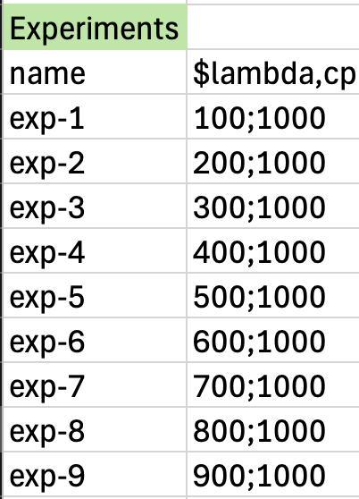
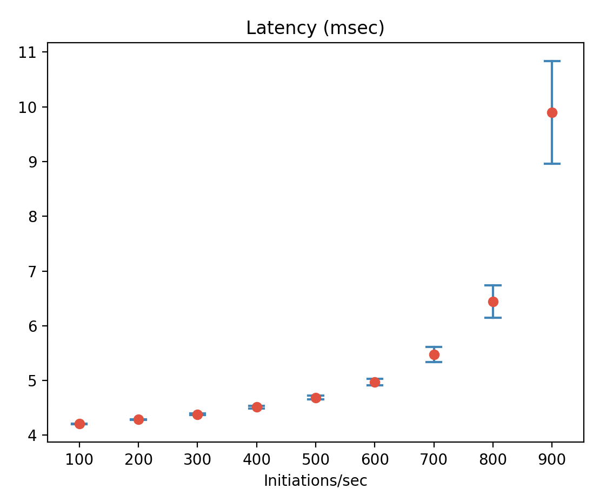
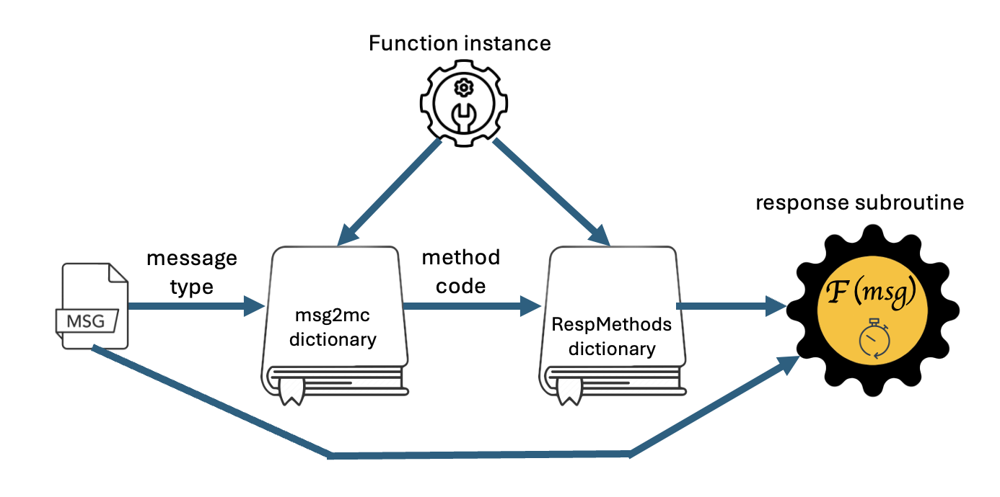
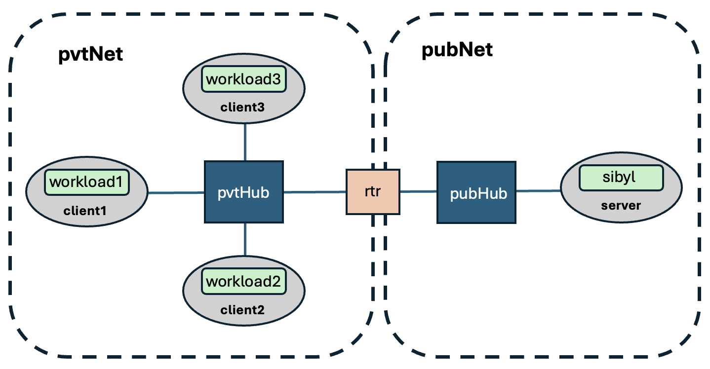
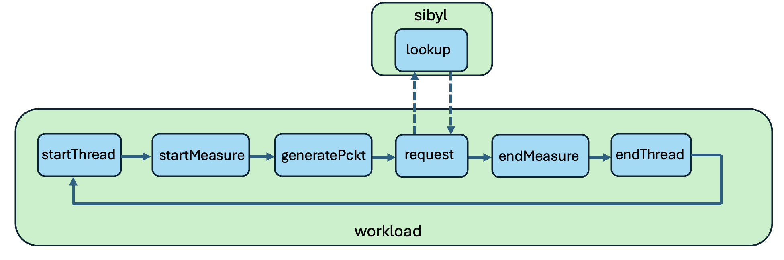
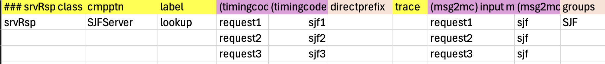
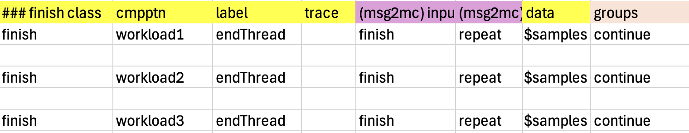
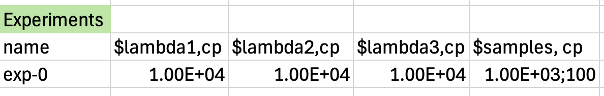

### User Extensions to pces

##### Overview

The **pces/mrnes** repositories at *github.com/iti* can be used to construct complex models that can be expressed in xlsxPCES and then run without the user needing to write a line of code in Go (the native language of the simulator). However, it is sometimes the case that a modeler requires modeling constructs and methods that are not built into the repository, and should not be uploaded into a public repository. Anticipating this, we designed the architecture of **pces** to support straightforward integration of modeling extensions that do not require those extensions to be integrated into the public github code base.   This has particular application in contexts where the modeler wishes to study systems whose representation in **pces** needs to be protected, for intellectual property and/or security reasons.

This document shows how to extend **pces** in three ways.   Their separation from the github repository are all based on the requirement that the code whose execution starts the simulation be in a 'module' called 'main' whose component files can come from anywhere.  Some of the separation techniques are made possible also by Go's architecture which lets modules import modules from a number of different places, including the user's own file directory.  

The first technique is to customize the set-up and tear-down methods called at the beginning and end of a simulation run.   Example models posted to github.com/iti/pcesapps have instances of these functions to serve as templates.  The example we discuss in this document changes the default set-up function to schedule at start-up the initiation of multiple execution threads, treated as a Poisson arrival process, for the purpose of observing the impact that inherent queueing has on the end-to-end round-trip times.   The default set-up in *github.com/iti/pcesapps/embedded* schedules only one round-trip per traffic source, so the extension illustrates both the integration of random sampling, and a different strategy for launching execution threads.   This first type of extension requires some addition of Go code whose execution is already built into the **pces** process, and no other modifications.

The second technique we demonstrate shows how a user can extend the set of command line arguments beyond the 'built-in' ones baked into *github.com/iti/pces/sim.go*, to include additional ones required by the modeler.  Like the first technique, this requires writing some Go code, but there is no needed to modify the state of the simulator defined by and initialized by code in *github.com/iti/pces* or  *github.com/iti/mrnes*. 

The third technique leverages the **pces** design that the "response method" called to handle the arrival of a message to a function is the result of a table lookup, whose index is completely determined by the message type of the message.   The modeler can create their own response methods, giving them complete control over what happens in response, how long the response takes,  and the messages that result from the response.  It is straightforward to register the user-written response method within the **pces** core so that the method is called when the appropriate message type is observed.   The example we use to illustrate this technique creates a version of the server function (in the *srvRsp* class) where the service is provided to multiple clients, with the 'shortest-job-first-preemptive-resume' queueing discipline, which is not already offered by **pces**.

##### 1. Extension by customized set-up / tear-down subroutine

The running example model described in [PCES-Overview](#https://github.com/ITI/pces/blob/main/docs/PCES-Overview.pdf) uses the short snippet of code shown below as the main entry point to running the simulator.

```
package main
import (
    "github.com/iti/pces"
    "fmt"
)

func main() {
    pces.ReadSimArgs()
    pces.RunExperiment(expCntrl, expCmplt)
}
```

​					      		 *Figure 1: Default entry point to **pces **simulation run*

After *pces.ReadSimArgs()* parses the command line parameters and performs an initial phase of setting up the internal data structures that support the simulation run, *pces.RunExperiment()* calls subroutine *expCntrl()* to initialize the event list with events that start execution threads whose round-trip delays are measured and ultimately reported.  *pces.RunExperiment()* 'sees'  *expCntrl()* simply as a pointer to a function to call, which means that that function can be provided by the user and not necessarily be part of the **pces** repository.  In the running example the *exp.go* file is in the same directory as the file listed above, as part of the *main* package.   There it is given as

```
package main
import (
  "github.com/iti/evt/vrtime"
  "github.com/iti/evt/evtm"
	"github.com/iti/pces"
)

func expCntrl(evtMgr *evtm.EventManager, context any, data any) any {
    // go through all comp patterns looking for functions of the 'start' class,
    // and schedule them for execution
    for _, cpi := range pces.CmpPtnInstByID {
        for _, cpfi := range cpi.Funcs {
            if cpfi.Class == "start" {
                evtMgr.Schedule(cpfi, &cpfi.Class, 
                    pces.EnterFunc, vrtime.SecondsToTime(0.0))
            }
        }
    }
    return nil
}
```

​				        *Figure 2: expCntrl subroutine used in running example*

The code finds every instance of the model of a function from the 'start' class, and schedules an immediate execution of the *pces.EnterFunc* function to initiate the execution of that function and the execution thread that follows its initiation.

We can imagine though experiments where the round-trip delay between two points may vary from round-trip to round-trip, as there are network objects along the execution path where queuing is introduced when needed to govern competing access to shared resources. In **mrnes** a computational endpoint where **pces** functions are executed is declared to have a particular number of cores available.  If the pattern of function executions on different computation patterns (hereafter, CmpPtn) induces concurrent requests for computational service, the endpoint's bank of cores will be committed to serving as many of these as are possible, leaving others to wait in queue for service.   Other points in a **pces/mrnes** model where queueing may be induced is at network interfaces where messages are pushed through the network.   It is possible for multiple messages (from multiple concurrent execution threads) to converge on an interface, meaning that its bandwidth has to be shared among them or that some wait for others to receive transmission bandwidth before they do.   The impact of queueing on round-trip delays can be significant under traffic patterns of sufficiently heavy load.  Indeed, one of the reasons for conducting such a simulation experiment is to observe just how heavy the load must be for those impacts to be significant.

Figure 3 below gives a different version of  *expCntrl()* .  The model that uses it initializes the 'Data' parameter (a string) of a *start* function to hold two parameters.   The string uses a semi-colon to separate the first parameter---an arrival rate (in packets/sec) from the second parameter---the number of execution threads to launch from this function.    The logic samples randomly distributed inter-initiation delays, from the exponential distribution whose rate is given by the first parameter.   

```
func expCntrl(evtMgr *evtm.EventManager, context any, data any) any {
    rand.Seed(seed)

    // go through all comp patterns looking for functions of the 'start' class,
    // and schedule them for execution
    for _, cpi := range pces.CmpPtnInstByID {
        for _, cpfi := range cpi.Funcs {
            if cpfi.Class == "start" {
                // get lambda from the "Data" element of the function's configuration
                srtcfg := cpfi.Cfg.(*pces.StartCfg)
                params := strings.Split(srtcfg.Data,";")
                if len(params) != 2 {
                    panic("expect Data input to Start function to be lambda;count")
                }
                lambda, err := strconv.ParseFloat(params[0], 64)
                if err != nil || !(lambda > 0.0) {
                    panic("expect lambda in Data input to Start function 
                    		to be positive floating point number")
                }
                burstLen, errN  := strconv.Atoi(params[1])
                if errN != nil || !(burstLen > 0) {
                    panic("expect burstLen in Data input to Start function 
                    		to be positive integer")
                }
                arrivalTime := interArrival(lambda)
                for idx:=0; idx<burstLen; idx++ {
                    evtMgr.Schedule(cpfi, &cpfi.Class, 
                    		pces.EnterFunc, vrtime.SecondsToTime(arrivalTime))
                    arrivalTime += interArrival(lambda)
                }
            }
        }
    }
    return nil
}
```

​				*Figure 3: expCntl subroutine to create a set of start function initializations*

The fact that these parameters can be specified and varied from experiment to experiment is illustrated by Figure 4 where in Figure 4a we see the xlsxPCES row (in the cp sheet) that configures the single start function in that model, noting in particular the $lambda symbol in the 'Data' column, and in Figure 4b we see the specification of experiments to be run, where the arrival rate of the start initializations is steadily increased.  The bottleneck step in the pipeline of function calls induces queueing and has a service requirement of 1ms, which is 1000 musecs, the units of the lambda values in the table.  Arrival rates greater than or equal to 1000 packets per second inhibit stationary queue behavior.



​					*Figure 4: Specification of symbol value for 9 experiments of the example model*

When the simulation has ended, the subroutine *expCmplt()* is called.   The default version, included in the running example from [PCES-Overview](#https://github.com/ITI/pces/blob/main/docs/PCES-Overview.pdf), is given as Figure 5 below.

```
func expCmplt(evtMgr *evtm.EventManager, context any, data any) any {
    // go through all comp patterns looking for functions of the 'start' class,
    // and schedule them for execution
    msrFileName := *context.(*string)
    exprmnt := *data.(*string)

    if len(pces.Measured.Measurements) > 0 {
        pces.SaveMeasureResults(msrFileName, exprmnt, true)
    }

    // put the trace file in the same directory as the msrFile
    tdirectory, file := filepath.Split(msrFileName)
    file = "trace.yaml"
    traceFile := filepath.Join(tdirectory, file)
    pces.TraceMgr.WriteToFile(traceFile, false)
    return nil
}
```

​			*Figure 5: Post-simulation run clean-up routine expCmplt from running example*

All that this version of *expCmplt()* does is to serialize and save the measurements made, as well as write the trace file to the same directory.  The first few lines of the file where measurements were saved appear as below.

```
  - index: 1
    latency: 4.144 (msec)
    measurename: end2end
    waypoints: []
  - index: 2
    latency: 4.957000000000001 (msec)
    measurename: end2end
    waypoints: []
  - index: 3
    latency: 4.144 (msec)
    measurename: end2end
    waypoints: []
  - index: 4
    latency: 4.164 (msec)
    measurename: end2end
    waypoints: []
        ...
```

​				*Figure 6: Partial output created by expCmplt from running one experiment example model*

Each item in this yaml list summaries the output of one measurement, e.g., the results of one execution thread initiation scheduled by the code in Figure 3. The individual measurements each have their own 'index', denoting the ordinal position of the measurement in the experiment.  All the records here have the same 'measurename' because they are are measurements taken between the same two points. And of course, each measurement is of the end-to-end latency observed.

As shown by the code in Figure 3 and the initialization shown in Figures 4a and 4b, each experiment performs 1000 iterations.   The code in Figure 5 reports each of those separately, which is appropriate if the user's intention is to parse the output files and use a statistical analysis tool to learn about the the dependency of the latency on the inter-initiation arrival rate.  But some form of that kind of analysis could be moved inside of *expCmplt* , provided that code got access to the data.

Access to measurements at the end of the run requires digging into *pces/measure.go*.  There a globally accessible variable *pces.Measured* points to an instance of the *pces.MsrData* structure

```
// MsrData is the structure which holds the Measured output,
// and whose serialization is written to file when finished
type MsrData struct {
    Exprmnt string
    Measurements []PerfRecord
}
```

​		*Figure 7: **pces** data structure that holds a list of measurements taken during a simulation run*

where we see that structure *pces.PerfRecord* holds measurements

```
// PerfRecord stores the Measured information about the packet Measure and the
// flow Measure from SrcName CP to DstName CP
type PerfRecord struct {
    MeasureName string
    Index       int
    SrcDev      string
    SrcCP       string
    SrcLabel    string
    DstDev      string
    DstCP       string
    DstLabel    string
    Latency     string
    Waypoints []MeasureStep
}   
```

​	*Figure 8: **pces** data structure that holds a single measurements taken during a simulation run*

The only attributes of interest to us here are *MeasureName* and *Latency*, the former being a name for the endpoints of the latency measurement, and the latter being a string of the form "v  (time unit)" where v is a float64 representation of the observed latency, and 'time unit' records the unit of time indicated as one of the simulator's command line argument.  So then the complete set of measurements taken during a run can be accessed from within *expCmplt()* by referencing *pces.Measured.Measurements[]* and parsing the 'Latency' attribute of each record.

We might use this access, for instance, to compute batch-means (Banks et. al, 2014) on sequential groups of 50 observations, and compute a mean latency and confidence interval based on the assumption that the batch means are statistically independent.  

With appropriate modification, subroutine *expCmplt()* can produce a statistical summary of all the measurements taken during the run.   While the code below with a sample *expCmplt()* has more detail than is probably interesting, it does at least illustrate the access to the measurements and calculations that may be done on them.

```
func expCmplt(evtMgr *evtm.EventManager, context any, data any) any {
    msrFileName := *context.(*string)
    exprmnt := *data.(*string)

    measurements := pces.Measured.Measurements

    // initialize collection variables  
    sqrSum := 0.0; sampleSum := 0.0; N := 0;

    // variables 'skip', 'batchSize', and 'lambda' are globals 
    // already initialized by the time of this call

    var units string    // remember the units designation

    // ignore the first 'skip' number of batches to avoid initialization bias
    for idx:= skip*batchSize; idx<len(measurements); idx += batchSize {
        sum := 0.0

        // compute the mean latency over the current batch
        for jdx := idx; jdx < idx+batchSize; jdx++ {
            words := strings.Split(measurements[jdx].Latency," ")

            // first word should be latency value
            value, err := strconv.ParseFloat(words[0], 64)
            if err != nil {
                panic(err)
            }
            sum += value

            // remember the 'units' string
            if len(units) == 0 {
                units = word[1]
            }
        }

        // compute the sample point, mean of the batchSize latencies
        sample := sum/float64(batchSize)

        // gather data in preparation for variance calculation
        sampleSum += sample
        sqrSum += sample*sample
        N += 1
    }

    // compute the variance
    fN := float64(N)
    mean := sampleSum/fN
    sqrMean := sqrSum/float64(N)

    // not widely used but highly valuable expression for variance:
    // Var(X) = E[X^2]-E[X]^2
    stddev := math.Sqrt(sqrMean - mean*mean)

    // compute 95% confidence interval side
    ci := 1.96*stddev/math.Sqrt(fN - 1)

    // create a record for file
    lci := createLatencyCI(exprmnt, saveLambda, N, batchSize, skip, mean, ci, units)
    outputStr,_ := lci.Serialize(true)

    // open the output file
    f, cerr := os.Create(msrFileName)
    if cerr != nil {
        panic(cerr)
    }
    // write the serialized LatencyCI to file
    _, werr := f.WriteString(outputStr)
    if werr != nil {
        panic(werr)
    }
    f.Close()
    
    // put the trace file in the same directory as the msrFile
    tdirectory, file := filepath.Split(msrFileName)
    file = "trace.yaml"
    traceFile := filepath.Join(tdirectory, file)
    pces.TraceMgr.WriteToFile(traceFile, false)
    return nil
}
```

​	*Figure 9: expCmplt() function that computes mean and standard deviation using batch means*

A data record produced as a result of this execution appears below as Figure 10.

```
  batchsize: 50
  ci: 0.13898976526455487
  experiment: exp-7
  lambda: 700
  mean: 5.471208571428568
  samples: 175
  skipped: 25
  units: (msec)

```

​			*Figure 10: Sample statistical summary of multi-measurement simulation experiment*

This data record is drawn from a study we performed a study to estimate the mean end-to-end latency in the running example, as a function of the execution thread initiation rate.   For each experiment (meaning fixed initiation rate) there were 10000 execution thread initiations,  with randomly sampled delays between initiations being drawn from an exponential distribution.   The example in Figure 10 is the result when that rate was set to 700 initiations/sec.   In each experiment the size of the batches was 50 measurements, and the first 25 batches (1250 measurements) were discarded to reduce the initialization bias.   Each successive block of 50 measurements were averaged to produce one batch-means sample, so that there were a total of 175 such averages taken as samples.  The mean and 95% confidence interval were computed over this set of averages; the time units of the measurements is milliseconds.

Taken over a range of values of lambda from 100 to 900, post-processing generation of a graph led to the graphic below which plots the mean and 95% confidence interval based on 175 batch-mean samples per experiment.



​			*Figure 11: Statistical estimate of mean end-to-end latency as a function of measurement initiation rate*

The shape of the curve meets our expectations, as we know the queuing behavior will not be stationary for lambda 1000 or larger, as there is a step in the system that serializes all accesses and has a service requirement of 1 msec.  If requests were presented to that step faster than 1000/sec they would tend to back up without bound because they cannot be serviced that fast.

Thus we see that a user can provide a certain level of customization to a model simply by rewriting the start-up and tear-down routines called at the beginning and end of each simulation run.

##### 2. Including additional command-line arguments

Elsewhere we've documented the command-line arguments expected by the simulator using the [cmdline](#https://github.com/iti/cmdline) package, and what a modeler does to give them desired values.   We've also seen how through the use of symbols and the *experiments* sheet of an xlsxPCES spreadsheet a user can convey parameters to pre-defined parameters in model objects.   There is another way, where a modeler can define new command line arguments to *also* be accessible to an extended model.

The technique is enabled by the logic of the *github.com/iti/cmdline* package. The application program describes the command line inputs it wants to be recognized, and passes them to a function in the *cmdline* package that returns a command-line parsing object, imagine that this is stored in variable *cp*.   The call *cp.Parse()* analyzes the text words that appear on the command-line and parses based on what it finds there.  One key here for us is that *cp.Parse()* looks at list *os.Args[]* for the arguments.   This list is created for every Go program when it begins to run, mirroring the *argv* array in C, C++, and python programs---*os.Args[N]* holds the string which is the Nth word on the command-line (word differentiation comes from white space separation).  Another key for us is that *cp.Parse()* looks at the first command word, and if it is '-is' interprets the second command word as the name of a file in which the command-line flags and their assignments are found, and parses the contents of the file just as though the words it contains appeared on the command-line.   Importantly for our purposes, *cp.Parse()* does not make any assumptions about the rest of the words on the command line, and on finding a file referenced by the first two command arguments, ignores any others that might be present.

A user can integrate their own command-line definitions and include assignments by following a number of steps.  The user writes code that establishes user-defined *github.com/iti/cmdline* command line flags, and creates a file, say, 'usercmds', that contain those flags and assignments to their values.  The user causes the command line presented to the simulator to reference to this file first, e.g. '-is usrcmds', and causes code that defines and parses the user command flags to be run before the simulator's own analysis of the command-line.  User code can use the extracted values as the user sees fit.   Finally, user code can remove the first two elements of *os.Args[]*, namely '-is' and 'usercmds', and return control to *pces* logic that then proceeds to parse the normal command-line.

We now make this description concrete, by example.  In the previous example of computing batch means there are parameters where a user will want some direct control, the initiation rate (lambda), the batch size, the number of batches to skip before computing batch-means samples,  the number of execution thread initiations per experiment.   We've seen already that the initiation rate and initiations per experiment can be expressed as symbols in an xlsxPCES model description of experiments, but placement of the other parameters in that model would be awkward and likely non-intuitive.

It is trivial to get access to the command line before the main **pces** logic engages with it, you simply need to write a new function to deal with the user command-line stuff, and call it first.   Here is *sim.go* revisited:

```
package main
import (
    "github.com/iti/pces"
)

func main() {
    readUserArgs()
    pces.ReadSimArgs()
    pces.RunExperiment(expCntrl, expCmplt)
}
```

​		*Figure 12: sim.go with call to user-provided function that reads user-defined command-line arguments*

The *readUserArgs*() routine needs to be in a file in the same directory as *sim.go* which is also labeled as part of the *main* package.   We show below the body of that subroutine in our example.

```
package main
import (
	"github.com/iti/cmdline"
	"os"
)

var confLevel float64
var samples int
var batchSize int
var skip int

func readUserArgs() {
		// get a parser
    cp := cmdline.NewCmdParser()
    
    // tell the parser what to expect
    cp.AddFlag(cmdline.FloatFlag,  "confLevel", true)
    cp.AddFlag(cmdline.IntFlag,    "samples", true) // nm
    cp.AddFlag(cmdline.IntFlag,    "batch", true) // nm
    cp.AddFlag(cmdline.IntFlag,    "skip", true) // nm

		// Parse() will open the user command line file
    cp.Parse()

		// pull the user given values into global variables
    confLevel = cp.GetVar("confLevel").(float64)
    samples = cp.GetVar("samples").(int)
    batchSize = cp.GetVar("batch").(int)
    skip = cp.GetVar("skip").(int)

    // get rid of the "-is usercmds" at the beginning of the command line
    os.Args = os.Args[2:]
}
```

​			*Figure 13: Example of a user-provided function that reads user-defined command-line arguments*


The file 'usrcmds' has contents

```
-skip 25 
-samples 10000
-batch 50
-confLevel 95.0
```

​			*Figure 14: Example of a file contents of a user-defined command-line arguments*

And that's all there is to including user-specified command-line arguments for use within a **pces** simulation.  Naturally, these arguments will not be referenced by code within the github.com repositories, but will be available to other user code integrated into the *main* package, e.g. either by the first extension technique we discussed, or the one to follow below.

##### 3. Extension by user developed message response methods

The first two extension techniques we've covered work at the edges, the beginning and the ending of a simulation run.  The next technique allows a modeler to integrate code that is executed inherently in the midst of a running **pces** simulation experiment.

In [PCES-Overview](#https://github.com/ITI/pces/blob/main/docs/PCES-Overview.pdf) we describe the steps involved in selecting a subroutine to call in response to a message arriving at a **pces** function.   Figure 15 graphically illustrates the process.



​						*Figure 15: Selection of response function to call on receipt of a message*

To cause *some* code execution associated with a function receiving a message---a response method---the **pces** infrastructure schedules the event handler *pces.EnterFunc*().   One of the arguments passed to the handler is a pointer to the function, another is a pointer to the message being delivered.  *pces.EnterFunc*() extracts both of these arguments, uses the function pointer to find the function's *msg2mc* dictionary, and then uses the message's message type as index to look up a 'method code', which is used (among other things) to index into another of the function's dictionaries, *RespMethods*.   The dictionary item found is a `RespMethod` struct, illustrated below.  The `Start` value points to the subroutine to call in response to to the message, and the `End` value points to an event handler to schedule when the function simulation has completed. 

```
// RespMethod associates two RespFunc that implement a function's response,
// one when it starts, the other when it ends
type RespMethod struct {
    Start StartMethod
    End   evtm.EventHandlerFunction
}   
```

​				*Figure 16: **pces** struct holding pointers to subroutines to call on a message arrival, and departure*

Here `StartMethod` is a function signature 

```
// StartMethod gives the signature of functions called to implement
// a function's entry point
type StartMethod func(*evtm.EventManager, *pces.CmpPtnFuncInst, string, *pces.CmpPtnMsg)
```

and likewise `evtm.EventHandlerFunction` is a function signature

```
// EventHandlerFunction is invoked when the the corresponding event's simulation time is least
type EventHandlerFunction func(*evtm.EventManager, any, any) any
```

The way is clear for having a user-developed routine called in response to a message arrival at a function---the user writes and includes subroutines to place in a `StartMethod` struct, and arranges to have that struct integrated into the function's `RespMethods` dictionary.  To accomplish the latter task the user will need some knowledge of **pces** data structures and methods, which we will document in an example.

###### Example

The xlsxPCES model and code we present here as user developed code are posted to the *pcesapps/userresponse* directory for reference.

In this example there are three clients requesting service from a single server.   Each client is in a loop where it makes a request for service, waits for a response that the service was granted, pauses for a random period of time, and then repeats. The measure of interest is the end-to-end time from when the request is generated to when the client recognizes the report of completion.   Each client has a different service demand.

This example is laid out on a system model that has two networks (**pvtNet** and **pubNet**), a router (**rtr**) that spans both, and two switches (**pvtHub** and **pubHub**), one per network, see Figure 17.  **pvtNet** has three client processors, each carrying a CmpPtn whose name includes 'workload'.   **pubNet**  has just one processor, carrying a CmpPtn  called 'sibyl'.   



​			*Figure 17: Network for example illustrating user extension through user-defined response functions*

The experiment is set up so that the server can be holding more than one request for service simultaneously, but only serves one request at a time.  The default methods in **pces** service each request, in its entireity, using the first-come-first-serve queueing discipline.  The example is provided to show that a user can extend **pces** to provide a different queuing discipline, e.g., shortest-job-first-preemptive-resume.  In this discipline  (called SJF hereafter) the request receiving computational attention is always the one whose remaining unfulfilled service time is least among all active concurrent requests.  This means that if a new job arrives with a service demand that is smaller than the remaining service of the job receiving service, the remaining service time of that active job is save, that job is suspended, and the new job immediately begins service.   When one job completes service the active job with least residual service time is put into service.

This example has two types of CmpPtns, 'workload' and 'sibyl',  illustrated in Figure 18. 'workload' patterns use functions we've seen before in  [PCES-Overview](#https://github.com/ITI/pces/blob/main/docs/PCES-Overview.pdf), that start a thread, begin a measurement, spend a little computation time creating a service request packet, and then request service from a server.  The default **pces** response functions are perfectly adequate for each of these, and are adequate to complete the measurement after receiving notification that service has been completely granted.



​								*Figure 18: CmpPtns for example in Figure 17*

The user extensions are needed though to give the 'lookup' function in 'sibyl' a customized response method that implements SJF queuing, and to provide the 'endThread' function in 'workload' with a customized response method that introduces a delay, then initiates another round of measurement between the same two endpoints.

Returning our attention to Figures 1 and 15, the delicate part is integrating pointers to these user-defined functions into the **pces** internal infrastructure.  The key is to make the introduction after the **pces** internal data structures are created for the simulation run, but before the run begins. But this is precisely the same point where the initial scheduling of events by *expCntl* (recall Figures 1 and 2) occurs.   So the user may write a subroutine, say, *extendSetup*, and call it from within *expCntl*, e.g., the first line of the subroutine body.

*extendSetup* will need to find all the functions whose *RespMethods* dictionaries need to be augmented.  Within **pces** functions are organized within CmpPtns, and so one approach is to visit every function of every CmpPtn.   There is a global dictionary *pces.CmpPtnInstByName* that maps CmpPtn names to pointers to the representation of the CmpPtn.  The struct this dictionary points to is *pces.CmpPtnInst*,  and this struct has two fields of particular interest to us here.

```
// CmpPtnInst describes a particular instance of a CompPattern,
// built from information read in from CompPatternDesc struct and used at runtime
type CmpPtnInst struct {
    ...
    Funcs     map[string]*CmpPtnFuncInst
    FuncsByGroup map[string][]*CmpPtnFuncInst 
    ...
}
```

​							*Figure 19: Selected fields of the CmpPtnInst structure*

`Funcs` is a directory indexed by function label, holding pointers to all the functions associated with the CmpPtn.  The `CmpPtnFuncInst` struct is the one with the *RespMethods* dictionary that *extendSetup* needs to augment.  Furthermore, this struct offers a global method *AddStartMethod(methodCode, respMethod)* that adds an entry to that dictionary mapping the methodCode to a new *RespondMethod* structure with *respMethod* as the *Start* value, and *pces.ExitFunc* as the *End* value.  For the example at hand, the example below of *extendSetup* establishes the user-defined response function *srvRspSJF* for function *lookup*, and establishes the user-defined function *finishRepeat* for each of the three workload CmpPtn *endThread* functions.

```
func extendSetup() {
	pces.CmpPtnInstByName["sibyl"]["lookup"].AddStartMethod("sjf", srvRspSJF)
	pces.CmpPtnInstByName["workload1"]["endThread"].AddStartMethod("repeat", finishRepeat)
	pces.CmpPtnInstByName["workload2"]["endThread"].AddStartMethod("repeat", finishRepeat)
	pces.CmpPtnInstByName["workload3"]["endThread"].AddStartMethod("repeat", finishRepeat)
}
```

​				  *Figure 20: Minimal expression of extendSetup explicitly using CmpPtn and label names*

In addition to this very direct method of extending a function's set of available response methods,  there is another built around the notion of function 'groups'.   The configuration struct for every function includes a list of strings called 'Groups' (recall [xlsxPCES](#) ), and in the configuration process a user can put any string in Groups, for any function.   A user can use this then to 'tag' functions for special attention, such as the dictionary extension under discussion.  We see this in the xlsxPCES snippets from the cp sheet describing the configuration of function 'lookup', and the 'endThread' functions from the three instances of the 'workload' computational CmpPtn.





​	*Figure 21: Initialization of 'Group' lists to identify functions to receive user-defined response methods*

We also infer from these tables that each of the threads requesting service use a different message type ('request1', 'request2', 'request3'), which lead to three different timing codes, allowing for three different service demands, tied to the thread requesting service.  We also see that each of these message types map to the same method code, 'sjf', and that the server's function 'lookup' is given a 'SJF' group tag.  Likewise we see that each of the functions of the 'finish' class have a 'continue' group tag, and their configuration's 'data' field is assigned the value of some experimental variable, $samples.

To support straightforward identification of functions belonging to particular groups, at model building time **pces** creates for each instance of a CmpPtn's *FuncsByGroup*, see Figure 19) that is indexed by group name, which is mapped to a list of pointers to functions in that CmpPtn which have been tagged with that group name.  

Figure 22 illustrates an implementation of *extendSetup* that uses group tags. It visits every instance of CmpPtn, for each looking for a list of functions belonging to group "SJF", or "continue".   On finding a function it checks first that the function class is the expected one, and if so, calls the function's 'AddStartMethod' to associate the method code ('sfj' or 'repeat') to user-defined functions `srvRspSJF' or 'finishRepeat'.

```
// user extension of core methods for srvRsp and finish function classes
func extendSetup() {
    // visit every CmpPtn
    for _, cpi := range pces.CmpPtnInstByName {
        // find list of functions in group "SJF", if any
        funcLists, present := cpi.FuncsByGroup["SJF"]
        if present {
            // visit every function in that group, in this CmpPtn
            for _, cpfi := range funcLists {
                // we need a function of the srvRsp class
                if cpfi.Class != "srvRsp" {
                    continue
                }
                // found one
                cpfi.AddStartMethod("sfj", srvRspSJF)
            }
        }

        // find list of functions in group "repeat", if any
        funcLists, present = cpi.FuncsByGroup["continue"]
        if present {
            for _, cpfi := range funcLists {
                // we need a function of the finish class
                if cpfi.Class != "finish" {
                    continue
                }
                cpfi.AddStartMethod("repeat", finishRepeat)
            }
        }
    }
}
```

​       *Figure 22: Example of user-defined subroutine called to set up pointers to user-defined functions*

Of course, the code in Figure 22 is considerably more involved than that of Figure 20, but could be used without modification in models with more servers and clients.   Our point here is to highlight options a user may have in developing customize response methods.

We've seen already that the response method functions must have a particular function signature, just to be recognized by the compiler as something that can be put into a *RespMethod* struct (see Figure 16).  However, the **pces** infrastructure expects more, in particular, it expects certain outcomes that will advance a message to the next function.   A user who develops custom response methods needs to understand and adhere to those expectations.

The file *pces/classes.go* has a default message response method for every function class.  For reference and review, the form of their names are "class"Enter, for "class" names *processPckt*, *start*, *finish*, *measure*, etc.  To illustrate the general approach to writing a message response method and to point out critical expectations **pces** has of it, Figure 23 lists the user-defined *finishRepeat* referenced above, with line numbers

```
  1 type repeatStruct struct {
  2     Repeat int
  3     Lambda float64  
  4 }   
  5 
  6 func finishRepeat(evtMgr *evtm.EventManager, cpfi *pces.CmpPtnFuncInst,
  7         methodCode string, msg *pces.CmpPtnMsg) {
  8     fng := cpfi.Cfg.(*pces.FinishCfg)
  9     fns := cpfi.State.(*pces.FinishState)
 10     fns.Calls += 1
 11     
 12     endptName := cpfi.Host
 13     endpt := mrnes.EndptDevByName[endptName]
 14     pces.AddCPTrace(pces.TraceMgr, cpfi.Trace, evtMgr.CurrentTime(), msg.ExecID,
 15         endpt.DevID(), pces.FullFuncName(cpfi, "finishRepeat"), msg)
 16     
 17     // get the repeat count from the Bespoke link
 18     if fns.Bespoke == nil {
 19         rs := new(repeatStruct)
 20         pieces := strings.Split(fng.Data,";")
 21         rs.Lambda,_ = strconv.ParseFloat(pieces[0],64)
 22         rs.Repeat,_ = strconv.Atoi(pieces[1])
 23         fns.Bespoke = rs
 24     }
 25  
 26     rs := fns.Bespoke.(*repeatStruct)
 27     
 28     // if we're not done, push the message out the outedge
 29     if fns.Calls <= rs.Repeat {
 30         pces.AdvanceMsg(cpfi, msg, "")
 31         cpfi.AddResponse(msg.ExecID, []*pces.CmpPtnMsg{msg})
 32         arrivalTime := interArrival(rs.Lambda)
 33         evtMgr.Schedule(cpfi, msg, pces.ExitFunc, vrtime.SecondsToTime(arrivalTime))
 34     }
 35 }
```

​						*Figure 23: Example of user-defined response method*

First of all, we see in lines 6 and 7 that the function signature of *finishRepeat* is that required, of a *StartMethod*.   Lines 8 and 9 create local variables that point to instances of a finish function's configuration structure and its state structure.   The peculiar-to-Go casting is due to function struct members *Cfg* and *State* being of type *any*, so to actually use them we need to know the type of the struct they point to, and make that part of the cast.   Note that the correctness of this cast cannot be checked at compile time, and so run-time errors will occur if *cpfi.Cfg* points to anything but a *pces.FinishCfg* struct, or *cpfi.State* points to anything other than a *pces.FinishState* struct.

Line 10 keeps track of the number of times this finish function has been called, a value used later to decide whether to initiate another measurement.   Lines 12 though 15 are common to response methods, gathering and reporting information about the instance of the call.  Other user-defined response methods can copy this, noting only that the name of the function reported on line 15 should reflect the name of the function that contains it.

Lines 18 through 24 extract information used to initiate further measurements.   The *FinishState* struct that *fns* points to has a field named *Bespoke*, whose type is *any*.   We can use that location to hold a pointer to a struct that contains information needed by this method.  So line 18 checks whether that has been done yet (we equally well could have tested for *fns.Calls == 1*), and if not creates a *repeatStruct* (defined on lines 1 through 4) to hold the rate for an exponentially distributed length of time to wait before initiating another measurement, and the total number of measurements to initiate.    Those two pieces of data are coded in a string, stored in the function's *Cfg* configuration struct with the name 'Data', and are separated in that string by a ';'.   This is just a device enabling us to encapsulate both pieces of data in one string, and can be observed in the xlsxPCES experiment sheet for this example (recalling that the data column of Figure 21 contains symbol $samples)								

​						  

​							*Figure 24: Example of user-defined response method*

Line 20 separates the two pieces of data, lines 21 and 22 convert them into floating point and integer representation, respectively, and line 23 stores the pointer to the *repeatStruct* in the *Bespoke* location, where on the next pass through this function the program will see a non-nil value and so perform the extraction and type conversion only once.

Line 26 recovers the pointer to the *repeatStruct* struct, on every pass through the method, and then line 29 tests whether the number of times *repeatEnter* has been called at this particular function instance has yet reached the maximum allowed, the value of *Repeat* stored in the *repeatStruct*.   If the maximum has been reached nothing further is scheduled.   Otherwise steps are taken to advance to another initiation.  Line 30 calls the function *pces.AdvanceMsg()*, found in *pces.class.go*,  which is used by most other built-in response methods.   This function updates critical fields in the message that store where the message should be directed next.  The logic has some complexity owing to a number of corner cases, but two common cases are easily described.    

- The function has only one outbound connection (e.g. declared in xlsxPCES on the cp sheet under the 'Connections' section),  and the last calling parameter to *AdvanceMsg* is an empty string.  In this case the outbound edge completely specifies the destination CmpPtn, label of the destination function, and type of the message.   These are copied onto the message.

- The function has at least one but possibly more than one outbound connection.   *AdvanceMsg*() searches for one whose message type label matches the last calling argument to *AdvanceMsg*(), and then copies the destination information and message type from that edge onto the message.

  

Examation of this example's xlsxPCES model will show that each of the three instantiations of the *finish* function all have one outbound edge, directed to its CmpPtn's *startThread* function, labeled with message type 'repeat'.

Line 31 places the updated message into a dictionary bound to the function, where the event handler *pces.ExitFunc*() will look for messages resulting from simulating this function. The index into that dictionary is carried in the message itself in a field named *ExecID*.  The index maps to a list of pointers to CmpPtn messages.  The argument shown, `[]*pces.CmpPtnMsgs{msg}`, is Go syntax that specifies such a list comprised of the single entry `msg`. 

Line 32 samples an exponentially distributed random variable with parameter *rs.lambda* from a function defined in the same file.

```
func interArrival(lambda float64) float64 {
      return rand.ExpFloat64()/lambda
}
```

The last step, on line 33, is to schedule an execution of the event-handler *pces.ExitFunc()* to occur in the future, after the just sampled amount of simulation time (with units in seconds) has elapsed.

The user-defined response method *finishRepeat*() is a bit more complex, because unlike *finishRepeat()*, the timing of the final release from service of an arriving request is not known at the instant of the request.   At the time of an arrival, if the arriving job goes immediately into service we know when it will leave service provided that no job arrives that preempts it, schedule that event, but also retain a tag the event scheduler returns.   If an arriving job preempts the one in service, we use the tag to cancel the scheduled completion event and then schedule a new 'job completes service' event.   When a job does actually leave service, *finishRepeat()* copies the code the default logic for *srvRsp* functions uses to return the message to its sender (which involves copying particular fields of the message into its destination fields, refer to the code in *github.iti/pcesapps/userresponse/exp.go* for details).

