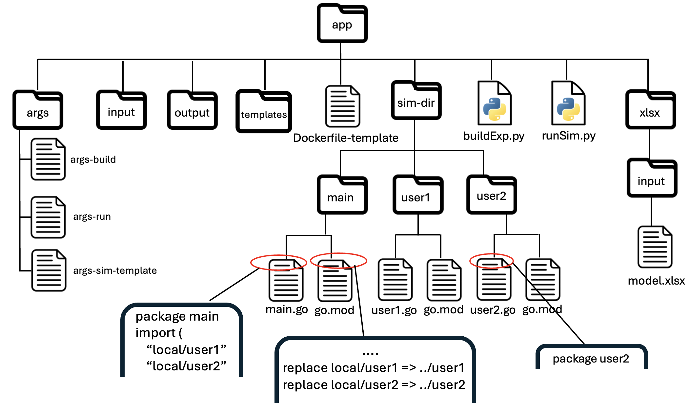
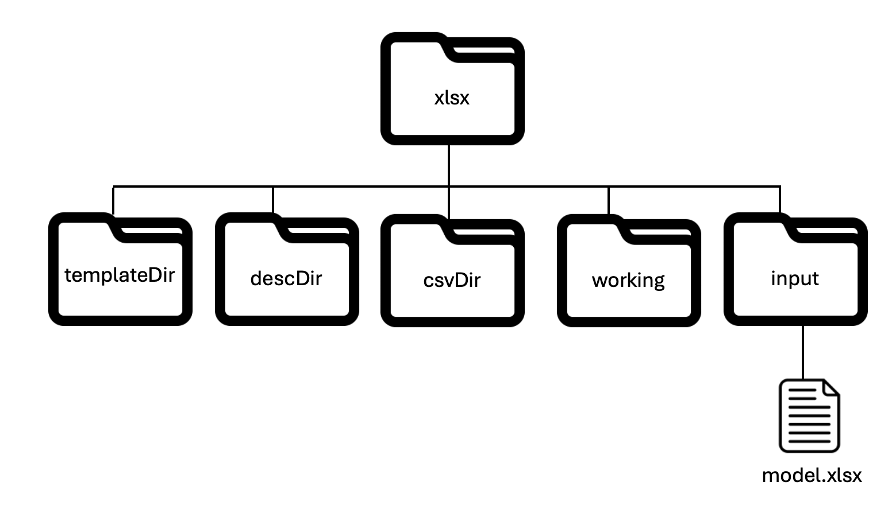
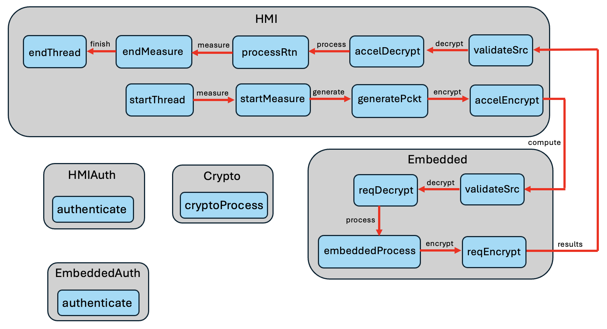
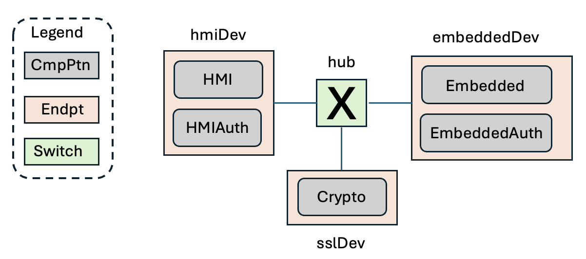
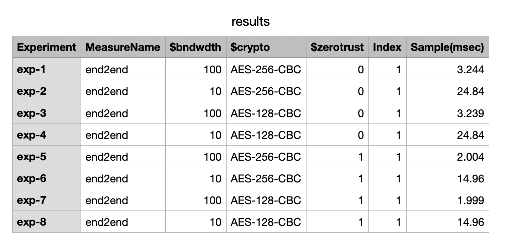
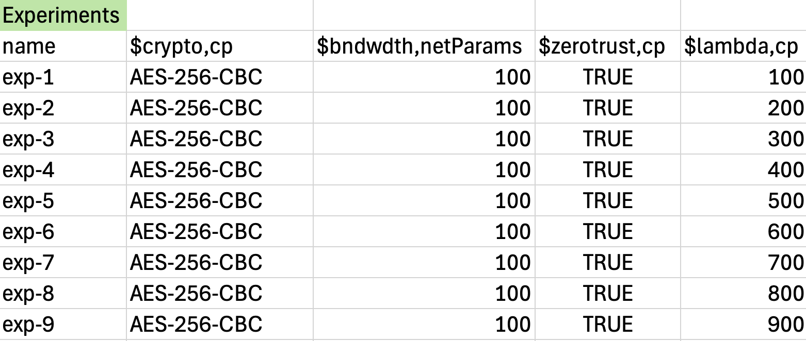
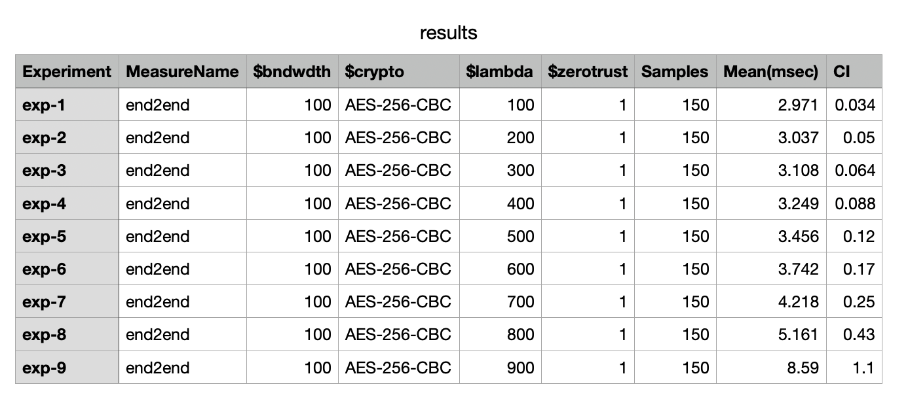
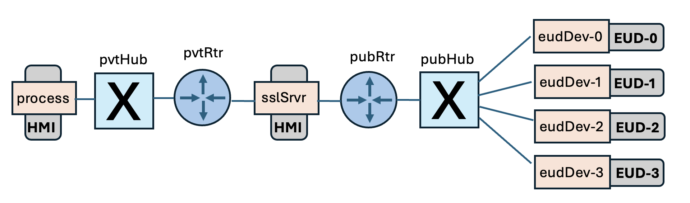
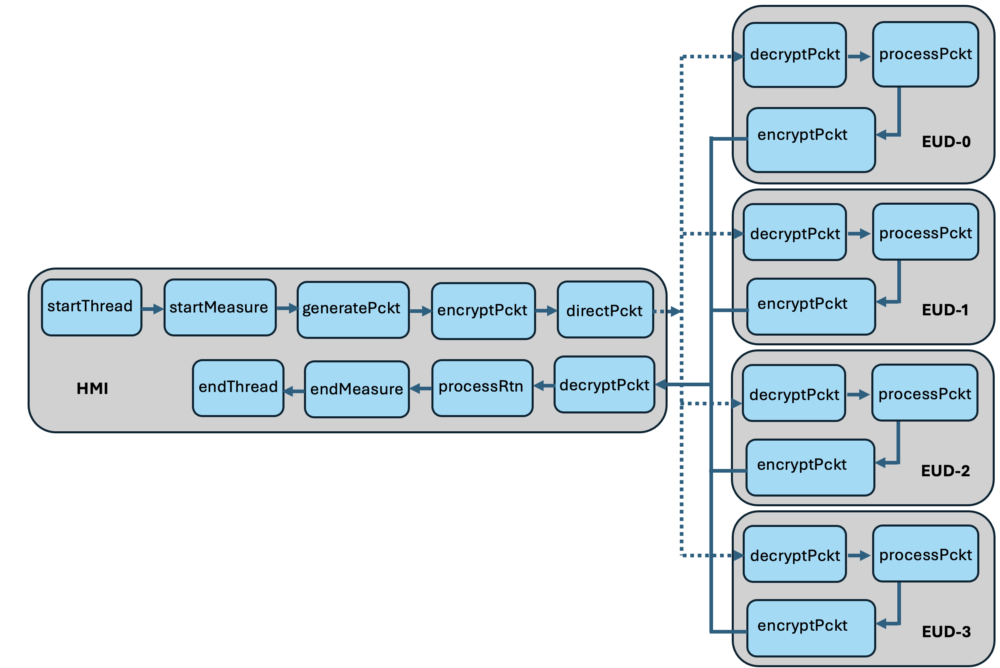
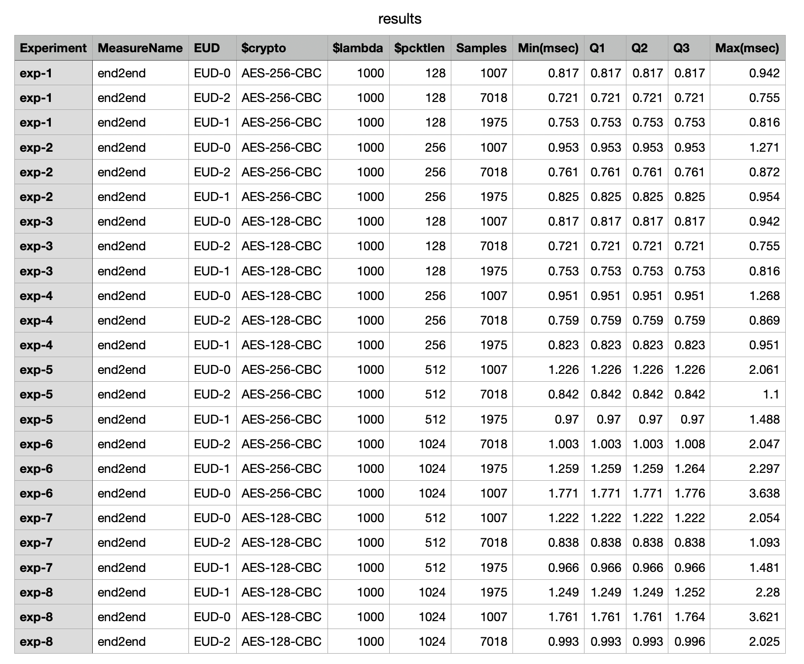

### **pces** application repository

#### Overview

The repository *github.com/iti/pcesapps* provides examples of **pces** applications for reference in model building.  The examples themselves are less about the applications themselvess than they are about illustrating various features, attributes available to a modeler. The examples are closely tied to the discussion in [User-Extensions](#) of ways a modeler can integrate their own code into **pces** models.   These examples are

- "Embedded",  of an HMI computer that offloads computational tasks to an embedded system.
- "Queuing" modifies the process for initiating measurements in the same system considered by "Embedded", showing in particular how a set of simulation runs can be set up to estimate end-to-end latency as a function of the offered load of requests to the system.
- "End User Devices" illustrates how a user can integrate custom code to direct messages to randomly selected destinations, each of which has a different processing overhead, and measure the average end-to-end latency depending on the end user device chosen.
- "SJF" constructs a completely different system from the first three, and is constructed to show how other ways that user-written pieces of the system model can be integrated into a **pces** model.   This capability is highlighted in anticipation of users needing to keep models and code separate from public repositories such as github.

Before getting into the details of each model we first describe the layout of the *pcesapps* repository, and the scripts it provides to build models, and to execute them.

#### Repository Structure

The root directory of  *github.com/iti/pcesapps* is called *pcesapps*, this is the directory created when the repository is copied or cloned into a user's space.   Every subdirectory of *pcesapps* is dedicated to a specific application model.   At the time of this writing there are three: *embedded*, *queueing*, and *sjf*, corresponding to the three examples listed above.

One intent of the overall structure is to regularize and simplify the process of creating a new model.   Ideally a user need only to copy an existing application subdirectory and then replace or modify select functions, in ways that we will identify.   

The structure of an application's subdirectory is likewise regularized.  Each is identical, at least in the names of the files and subdirectories.   These are

- *buildExp.py* , a script one calls to build the executables and the input files required to perform a set of simulation runs as an experiment.
- *runSim.py* , a script one calls to perform the set of simulation runs defined by the model to consistute an experiment.
- *templates*,  a subdirectory that is filled by *buildExp*.py with templates of input files required for a simulation run.  These templates have embedded symbols that for each simulation run are replaced with some specific value defined for it for that run.
- *input*, a subdirectory that is filled by *runSim.py* with each individual run of the experiment, with the input files that result after replacing the symbols in files found in *templates* with the values called for by that experiment.
- *output*, a subdirectory where each simulation run writes its output, and where *runSim.py writes the summary output files, *output/results.yaml* and *output/trace.yaml*.

- *args*.   This is a subdirectory that holds argument files for scripts and the simulation run itself.  The contents of 'args' are
  -  *args-build*, the command-line argument file for *buildExp.py*. 
  - *args-run*, the command-line argument file for *runSim.py*
  - *args-sim-template* holds a set of command-line arguments that are provided to every simulation run in an experiment.  In preparation for each simulation run in an experiment, *runSim.py* concatenates the contents of this file with a set of other command-line arguments, and for that run creates file *args-sim*, which is the file presented to the simulation.
- *sim-dir* is a subdirectory that holds other subdirectories for modules from which the simulation executable is built.  The Docker option will build a container around this sub-directory.
- *Dockerfile-template* . The *buildExp.py* script can be directed to build a Docker container around the simulator executable.   The docker process for building a container is directed by a file with hard-wired name *Dockerfile*.  There may be variations in what precisely this file requires for a given application, so we have taken the approach of creating a file has the common structure, but includes symbols that are resolved and replaced for each application.
- *xlsx* is a subdirectory that primarily works as a scratch space for the call to *xlsxPCES* made from within *buildExp.py*.   Starting fresh (such as what is posted to the repository), *xlsx* has a single sub-directory called *input*, and if *buildExp.py* is instructed to build a model from an xlsxPCES spreadsheet, that file is in *input*.    


Figure 1 below graphically illustrates the structure of an application's directory.  Discussion to follow will further elucidate this structure.



***Figure 1: Structure of application directory in pcesapps repository***

#### buildExp.py

Assuming a user has an application directory structured as in Figure 1, their first step is to decide what elements of the model are to be constructed.   They edit the buildExp.py input file (args/args-build) to express their requirements, and then execute

```
% python buildExp.py -is args/args-build
```

from the command line.

The *buildExp.py* script provides the capability of starting with an xlsxPCES spreadsheet, and going all the way to a point where an a multi-run experiment can be run, including building the simulation executable or container wrapping an executable.  We imagine that a model may be built and rebuilt multiple times, particularly in response to changes the user makes to the xlsxPCES input file.  The specifics of the tasks it performs are encoded in its input command-line parameter file, *args/args-build*.  The fields are interpreted as follows:

| Flag       | Type    | Use                                                          | Required |
| ---------- | ------- | ------------------------------------------------------------ | -------- |
| -name      | string  | identify project, included in output                         | Yes      |
| -simexec   | boolean | When included indicate that native executable should be built | No       |
| -container | string  | When included gives tag for Docker container built around simulator | No       |
| -xpenv     | string  | Name of environment variable equal to path to xlsxPCES directory | No       |
| -xlsx      | string  | Name of xlsxPCES input file positioned in xlsx/input subdirectory | No       |

​							*Table 1: Command-line arguments for buildExp.py*

If -xpenv is included, then -xlsx must also be included.   Note that assignment of an environment variable typically involves adding that to a shell initiation file, and that the user must have downloaded or cloned *github.com/iti/pcesbld* to install the xlsxPCES tool.

Otherwise, a single call to buildExp.py may build the native executable *and* a container, or either one, or neither, and/or analyze the xlscPCES spreadsheet to create input files for a simulation experiment.

##### Building input files from an xlsxPCES spreadsheet

A companion document [Building an xlsxPCES Document](#https://github.com/ITI/pcesbld/blob/main/docs/xlsxPCES-v1.pdf) describes how to use an xlsxPCES spreadsheet to describe a *pces/mrnes* model.  When the -xlsx flag provides a name for an xlsxPCES input file (assumed to be in *xlsx/input*) *buildExp.py*  constructs a command-line input file for xlsxPCES, and spawns a process to run the tool.   The command-line input file points to subdirectory *app/templates* as the destination for its final output of templated input files for the simulator.   buildExp.py creates scratch directories under *app/xlsx* that xlsxPCES's own command-line arguments call for.   These are illustrated below.



***Figure 2: Structure of xlsx subdirectory of application directory***

The roles of 'templateDir', 'descDir', 'csvDir', and 'working' are all described in the companion document  [Building an xlsxPCES Document](#https://github.com/ITI/pcesbld/blob/main/docs/xlsxPCES-v1.pdf) .  What is important here is that buildExp.py writes command-line arguments for xlsxPCES to position those directories under the *app/xlsx*, and positions the directory *xlsxPCES* refers to as *yamlDir*---the final output directory for templated simulation input files, as *app/templates*.   The main purpose for positioning the scratch directories under *app/xlsx* is to make them easily accessible in the course of model development debugging.

##### Building executables

An executable is built if either *-simexec* or *-container* (or both) is present.   The processing assumes a particular file structure,  illustrated in Figure 1, and outlined below.

- The application's directory *sim-dir* is comprised solely of subdirectories, and (in the case of a container build), a file named *Dockerfile*.  
- Each subdirectory of *sim-dir* holds the files for a go 'package' (and possibly other non-Go files), one of the subdirectories must be named *main* and contain a file called *main.go*, which is the simulation program's entry point.  The first line of every Go file in a subdirectory named *subname* is ''*package subname*', a statement required by Go to associate the file with the Go package whose name is the subdirectory name.
- Each subdirectory *subname* of *sim-dir* holds a file named *go.mod*, which for our file organization is required by the Go compilation process.   If any *.go file in *subname* references a method or data structure in some *other* package *pckg* under *sim-dir*, then that file needs to import the package via an import statement such as `import local/pckg` and also include in *subname/go.mod* a statement `replace local/pckg => ../pckg`.   This tells the Go compiler that to import package *pckg* for *subname* it should go directly to the peer subdirectory *pckg* and not try to resolve *local/pckg*.   An important application of this technique is when the user has a Go package that is private, and should not be exposed to remote access.

##### Building a container 

Docker containers are identified by tags, and the *-container* flag specifies the tag to apply to the desired container.   However, it may well be that a container with the specified tag exists already.  If this is the case, *buildExp.py* prints a warning that it will not create another with that same tag, advising the user to directly remove the container if a new one is required.   The command for removing a container with tag TAG is

```
% docker rmi TAG
```

If  no warning is returned, the command used for building the container is

```
% docker build -t TAG .
```

The '.' symbol references a path, to the working directory, in which a file named *Dockerfile* is to be found and interpreted by Docker.   

When the intent is to make the container accessible to others, TAG may include a 'registry' url, e.g., 

Instructions in *Dockerfile* describe the steps in building the container, which define the subdirectory on the host that will appear in the container's 'space'.   Critically for us, this subdirectory must include all "user code", which we mean is all the code that is compiled to create the executable in files that are not part of public repositories.   User code can include Go syntax to import publically accessible modules with methods and data structures that it references, the subdirectory defining the container's space does not need to explicitly include copies or clones of those modules.   This requirement drives the architecture of the file structure in Figure 1.   The subdirectory *sim-dir* is the one that *Dockerfile* causes to be copied into the container.

Our main point here is that the construction steps in *Dockerfile* require knowledge of the existence and names of all the subdirectories under *sim-dir*.  We don't want to require a user to have to craft by hand a correct *Dockerfile* for every application, and so *buildExp.py* automates the process, by scanning all the subdirectories in *sim-dir* and then builds a bespoke *Dockerfile* for that application, placed in *sim-dir*.      The *Dockerfile-template* file in the application's main directory includes symbols that are replaced with strings derived from this analysis, with the file containing the substitutions being writting into *sim-dir* as  *Dockerfile* .

##### Building a native executable

To build the simulation executable on the host computer *buildExp.py* follows the same compilation steps as does the process for building a container.   It visits every subdirectory in *sim-dir*, checks for the existence of a file *go.mod*, and calls `go mod tidy` in order to establish record of dependencies before doing the compilation itself.    The main routine for the simulation executable is expected to be file *main.go* in subdirectory *main*.    On passing all sanity checks the file *main.go* is compiled by 

```
go build -o sim main.go
```

which creates an executable file named *sim* in the *main* subdirectory.

#### runSim.py

The runSim.py script coordinates the execution of multiple simulations that together constitue an 'experiment'.  Its actions are defined by the settings of its command-line parameters, described below.

| Flag       | Use                                                          | Required |
| ---------- | ------------------------------------------------------------ | -------- |
| -templates | Path to directory where templated input files are stored priority to running runSim.py | Yes      |
| -input     | Path to directory where the transformed input files for a given run are written, pre-run | Yes      |
| -output    | Path to directory where simulator will write results from simulation run | Yes      |
| -sim       | Path to directory where simulation executable resides        | No       |
| -user      | Path to file of user-defined command-line arguments          | No       |
| -extern    | Path to host directory mounted by container run command      | No       |
| -container | Tag name of container to run                                 | No       |
| -name      | Model name, included in simulation output                    | Yes      |

***Table 2: Command-line arguments for runSim.py***

The meaning of these selections are given below.

-  -templates, with default value being the path to the 'templates' directory illustrated in Figure 1. Each run shares many common parameters, but there is a set of parameter values that may vary from run to run.   Templated input files for the experiment may contain user defined variables (or symbols), and the full set of parameters used for a simulation run is obtained by substituting concrete assignments of values defined for that run to those symbols.   The result of choosing the -xpenv and -xlsx options for *buildExp.py* is to create and place those templated input files in the *templates* directory shown in Figure 1.  The default value of the *runSim.py* -templates flag is the path to that directory.
- -input, with default value being the path to the 'input' directory illustrated in Figure 1. Prior to each run, runSim.py copies the files in the templates directory into the directory selected by -input, and assignes ever appearance of a symbolic experiment variable with the value defined for it, for this run.    This directory serves both native execution, and container-based execution.
- -output, with default value being the path to the 'output' directory illustrated in Figure 1.  Both native and container-based executions write their output to this directory.
- -sim, with default value being the 'main' directory illustrated in Figure 1.   Directory where the native simulation executable is written.
- -extern, with default value (when non-empty) being the 'app' directory illustrated in Figure 1.   When an experiment is run using containers, the 'docker run' command cross-mounts a directory inside of the container with the value of the '-extern' flag, a directory on the host.    
- -container .  When non-empty the container tag flags that the simulation runs are to be performed using a container, and the value of the flag identifies the container to run.   Note that it is not necessary to have built this container with the buildExp.py step.   The tag names a container registry and the name of the container within that registry.    This means a service provider can have created the container and posted it to the registry, and provided the container's tag to a customer, who can write that tag as the value of the -container flag.
- -name is a label the user gives to the experiment,  a string which is copied into the simulation runs' output.


##### Coordination of simulation runs

The input file found in *templates/experiments.yaml* describes the symbolic variables that appear in input file templates, the particular files where they are found, and for each run the value assignment to be made to that variable.

*templates/experiments.yaml* contains a list of dictionary entries.    Each dictionary is tailored for one of the simulation runs.   One of the dictionary keys is 'name', with a string value that is the unique name for the simulation run.   All the other dictionary keys name a symbolic variable and a list of codes for the template input files where that symbolic variable appears.   The format of one of these keys is \$symbolname, code1, code2, ..., codek , where '\$' flags that the word following is a symbolname, and each of the 'codeX' words name one of the xlsxPCES spreadsheet sheets.   Each of these sheets is converted into one or two input files, and *runSim.py* maps sheet names to files as

- cp -> *cp.yaml*, *cpInit.yaml*
- execTime -> *funcExec.yaml*, *devExec.yaml*
- topo -> *topo.yaml*
- mapping -> *map.yaml*
- netParams -> *exp.yaml*
- experiments -> *experiments.yaml*

The value associated with a key is a string that for the named experiment is substituted in the indicated files for the symbol encoded in the key.

For example, imagine that *templates/experiment* contains the list

```
- $bndwdth,netParams: '100'
  $crypto,cp: AES-256-CBC
  $zerotrust,cp: '0'
  name: exp-1
- $bndwdth,netParams: '10'
  $crypto,cp: AES-256-CBC
  $zerotrust,cp: '0'
  name: exp-2
- $bndwdth,netParams: '100'
  $crypto,cp: AES-128-CBC
  $zerotrust,cp: '0'
  name: exp-3
- $bndwdth,netParams: '10'
  $crypto,cp: AES-128-CBC
  $zerotrust,cp: '0'
  name: exp-4
- $bndwdth,netParams: '100'
  $crypto,cp: AES-256-CBC
  $zerotrust,cp: '1'
  name: exp-5
- $bndwdth,netParams: '10'
  $crypto,cp: AES-256-CBC
  $zerotrust,cp: '1'
  name: exp-6
- $bndwdth,netParams: '100'
  $crypto,cp: AES-128-CBC
  $zerotrust,cp: '1'
  name: exp-7
- $bndwdth,netParams: '10'
  $crypto,cp: AES-128-CBC
  $zerotrust,cp: '1'
  name: exp-8
```

This describes an assignment of values for eight runs, named 'exp-1' through 'exp-8'. There are three symbolic variables defined, \$bndwdth, \$cypto, and \$zerotrust.   The first one may appear in file *exp.yaml*, the second and third ones may appear in files *cp.yaml* and *cpInit*.   The eight runs result from constructing all combinations where \\$bndwdth is in {'10', '100'}, \$crypto is in {'AES-128-CBC', 'AES-256-CBC'}, and \$zerotrust is in {'0', '1'}.   The fact that all values are strings is a consequence of the way we can transform an input file template into a actualized input file by substituting one string (a value) for another (the symbolic variable).

The overall coordination of the set of runs defining an experiment is then to loop through the dictionaries in *templates/experiments.yaml*, for each preparing the run by creating the simulation app's command-line file and assigning values to symbolic variables,  performing the run, and then gathering the run's output to aggregate into an overall report for the full set of runs.

##### Preparing for a simulation run

Every run of the simulation requires a set of command-line arguments for the simulation application.   *runSim.py* prepares a command-line file for each run, as there can be variation from run-to-run (e.g., the parameter that names the run of the experiment).  Many of these are set by runSim.py as a function of the assumed structure of Figure 1, some are drawn from a template *app/args/args-sim-template* .   The command-line arguments accepted by the simulator are listed below, with some commentary.

| Flag      | Type    | Use                                                          | Required |
| --------- | ------- | ------------------------------------------------------------ | -------- |
| exptmnt   | string  | Name of experiment run, writting into output                 | Yes      |
| inputLib  | string  | Path to directory with all input files                       | Yes      |
| outputLib | string  | Path to directory where all output is written                | Yes      |
| cp        | string  | Name of file with format of cp.yaml, see [API](#https://github.com/ITI/pces/blob/main/docs/API.pdf) | Yes      |
| cpInit    | string  | Name of file with format of cpInit.yaml, see  [API](#https://github.com/ITI/pces/blob/main/docs/API.pdf) | Yes      |
| funcExec  | string  | Name of file with format of funcExec.yaml,  see  [API](#https://github.com/ITI/pces/blob/main/docs/API.pdf) | Yes      |
| devExec   | string  | Name of file with format of devExec.yaml,  see  [API](#https://github.com/ITI/pces/blob/main/docs/API.pdf) | Yes      |
| map       | string  | Name of file with format of map.yaml,  see  [API](#https://github.com/ITI/pces/blob/main/docs/API.pdf) | Yes      |
| exp       | string  | Name of file with format of exp.yaml,  see  [API](#https://github.com/ITI/pces/blob/main/docs/API.pdf) | Yes      |
| topo      | string  | Name of file with format of topo.yaml,  see  [API](#https://github.com/ITI/pces/blob/main/docs/API.pdf) | Yes      |
| trace     | string  | Name of file where trace is written                          | No       |
| rngseed   | integer | Seed for random number generator                             | No       |
| stop      | float   | No event with event time larger than 'stop' is executed.   Absence implies termination when event list is exhausted. | No       |
| json      | boolean | Flag whether input files are in .json format.   Not well exercised option, probably should be deprecated. | No       |
| verbose   | boolean | Whether measurement output should include source and destination CmpPtn and Label information. | No       |
| tunits    | string  | Units of time used to report measurements, from {nsec, musec, msec, sec} | Yes      |
| container | boolean | Set to true when the simulation is running inside of a container | No       |

***Table 3: Command-line arguments for simulation executable***

*runSim.py* creates the simulation run input file and writes it into file *args/args-sim*, defining the values as follows:

- -exptmnt is taken from the input file *experiments.yaml*, where for each run the values to assign to the symbolic parameters are defined.
- -inputLib and -outputLib are the -input and -output flag values (respectively) from Table 2.
- -cp, -cpInit, -funcExec, -devExec, -map, -exp, and -topo values are 'cp.yaml', 'cpInit.yaml', 'funcExec.yaml', 'devExec.yaml', 'map.yaml', 'exp.yaml', and 'topo.yaml', respectively, being the names of files in directory *apps/input*.
- The values of -json, -trace, -rngseed, -tunits', and -stop are copied from file *args/args-sim-template*.
- -container is included if the -container flag in runSim.py's input file is non-empty, is otherwise left out (equivalent to setting to False).

*runSim.py*'s next step is to resolve symbolic variables in input files that contain them.   It can from analysis of the file *templates/experiment.yaml* determine which input files contain symbolic variables, and prior to the run creates for each a version constructed from its version in the *templates* directory one that is written into the *input* directory, using python's powerful string match-and-replace capability to substitute for each instance of the symbolic variable the concrete value specified for it this run within file *templates/experiment.yaml*. 

With the construction of *args/args-sim* and resolution of symbolic variables for the input files, the run is ready to be launched.

##### Executing a simulation run

*runSim.py* uses python's 'subprocess' module to call a simulation run, either on the native host or within a container.  In both cases the python code looks like

```
process = subprocess.Popen(cmdList, stdout=subprocess.PIPE, stderr=subprocess.PIPE, text=True)
stdout, stderr = process.communicate()

if process.returncode != 0: 
    print("Error from simulation run")

if len(stdout) > 0:
     print(stdout)
if len(stderr) > 0 :
     print(stderr)
```

where the call to subprocessPopen spawns a subprocess which is named with input arguments in the list 'cmdList', and establishes Unix pipes from the subprocess's stdout and stderr streams with runSim.py.    A return code indicates whether the command completed successfully, and then runSim.py prints out anything the simulator pushed out through stdout or stderr.

For a run using a container 'cmdList' is assigned as

```
cmdList = ["docker", "run", "-it", "--rm", "-v", mountCmd,  containerTag]
```

where mountCmd is a string that describes the association of an external directory with one inside the container, and 'containerTag' identifies the container.   The synax of 'mountCmd' is 'hostDir:containerDir' where hostDir is a path to a directory on the host machine and containerDir is a path to a directory within the container.   runSim.py sets hostDir to be the path to the 'app' directory in Figure 1, and to '/tmp/extern' within the container.   The  presence of the '-container'  flag in the simulation application's command-line argument file causes it to refer to '/tmp/extern' as the home directory for its input and output directories, and the absence of that flag causes it to refer to the directories passed to it through '-inputDir' and '-outputDir'.   Otherwise, whether the simulator app is running inside or outside a container is transparent.

### Sample Applications

We turn now to descriptions of several sample applications included in *pcesapps*.  The examples themselves are less about the applications themselvess than they are about illustrating various features, attributes available to a modeler.   Three of the examples are closely tied to the discussion in [User-Extensions](#) of ways a modeler can integrate their own code into **pces** models.   These examples are

- "Embedded",  of an HMI computer that offloads computational tasks to an embedded system.
- "Queuing" modifies the process for initiating measurements in the same system considered by "Embedded", showing in particular how a set of simulation runs can be set up to estimate end-to-end latency as a function of the offered load of requests to the system.
- "End User Devices" illustrates how a user can integrate custom code to direct messages to randomly selected destinations, each of which has a different processing overhead, and measure the average end-to-end latency depending on the end user device chosen.   It introduces the technique of configuring the internals of **pces** to call user defining routines to respond to received messages.  This capability is highlighted in anticipation of users needing to keep models and code separate from public repositories such as github.


#### Gathering and analyzing measurements

Before diving into the details of these example applications we document how **pces** is designed to gather observations and report them.  The system is built principally around the notion of measuring attributes of a path from one point in the model to another.   The attribute might be latency, it might be observed available bandwidth, it might be probability of packet loss, it might be something else that the user defines. The common thread is that there is a point where the measurement of this attribute starts, and another point where it ends.

**pces** provides the 'measure' class of functions to define these endpoints. Conceptually it is simple: when a message enters a 'measure' function configured to start a measurement, the initial state and time are saved and the message is tagged.   When the message is eventually delivered to a 'measurement' function configured to end a measurement, the measurement is complete.   There are details though that need attention.

Measurements between the same two points, at different times, for execution threads that all take exactly the same path between them form a natural grouping of measurements.   If there is random variation among measurements in the same grouping we may wish to compute statistics on that group.   We may wish to combine groupings, or further differentiate between elements in a group.   **pces** supports all of these activities, meaning that a **pces** agile modeler can integrate code they developed into the **pces** framework to accomplish these tasks.

**pces** default behavior is to group all measurements that follow the same sequence of functions and network devices between the same two points.   Its default behavior is to create a spreadsheet to summarize the measurements in a grouping, and offer to the user different options for what the spreadsheet repeats.   With a single keyword in the configuration a user selects whether they want all the measurements in a group reported, the mean and variance of all measurements in the group, the mean and confidence interval around a statistical estimate of a stationary mean measurement, or a statistical range of the measurements, including minimum, maximum, 25th percent quartile, median, and 75th percent quartile.

The applications to follow demonstrate these different options.

#### Embedded

###### Application structure

Figure 3 illustrates the computational patterns (CmpPtn) for the "Embedded" example.  For reference, please note that [Building an xlsxPCES Document](#https://github.com/ITI/pcesbld/blob/main/docs/xlsxPCES-v1.pdf) goes through expression of this model in *xlsxPCES* in some detail.



***Figure 3: Computational Patterns for "Embedded" application example***	


Figure 4 illustrates the mapping of the CmpPtns to the topology of the example, comprised of computational Endpoints 'hmiDev', 'embeddedDev' and 'sslDev', and a switch 'hub'.



***Figure 4: Topology of "Embedded example"***

The big picture for us is that this workflow describes generation of a request by an HMI computer to an Embedded computer to perform some specialized computation, and have the results of that computation returned.  

 There are a number of details at the next layer of description.   The communications between HMI and Embedded computers is encrypted, and so there are encrypt/decrypt steps to perform on both sides of a message transfer.   The crypto operations on the HMI computer use an on-board hardware accelerator, while the crypto operations on the Embedded computer use an off-processor crypto server.  The model represents an approach to zero-trust networking where before either computer accepts a message from the other, it first issues a challenge to the sender whose response is checked for validity before the message is accepted. 

The complexities of the model are almost entirely encapsulated in the simulator's input files.   These files are used principally to initialize internal simulator data structures, and then use the internal logic of the simulator to drive the model simulation.  Companion document [Building a PCES Model](#https://github.com/ITI/pcesbld/blob/main/docs/xlsxPCES.pdf) goes through the details of this particular model.  Here we show all that is needed to compile and run this model.

###### Application code

Figure 5 gives the code to compile, in its entirety, all of *app/sim-dir/main/main.go* in Figure 1.  No additional modules are needed, subdirectories *user1* and *user2* in Figure 1 are entirely absent.

```
  1 package main
  2 import (
  3     "github.com/iti/evt/evtm"
  4     "github.com/iti/evt/vrtime"
  5     "github.com/iti/pces"
  6     "path/filepath"
  7 )
  8 
  9 func main() {
 10     pces.ReadSimArgs()
 11     pces.RunExperiment(expCntrl, expCmplt)
 12 }
 13 
 14 func expCntrl(evtMgr *evtm.EventManager, context any, data any) any {
 15     // go through all comp patterns looking for functions of the 'start' class,
 16     // and schedule them for execution
 17     for _, cpi := range pces.CmpPtnInstByID {
 18         for _, cpfi := range cpi.Funcs {
 19             if cpfi.Class == "start" {
 20                 evtMgr.Schedule(cpfi, &cpfi.Class,
 21                     pces.EnterFunc, vrtime.SecondsToTime(0.0))
 22             }
 23         }
 24     }
 25     return nil
 26 }
 27 
 28 func expCmplt(evtMgr *evtm.EventManager, context any, data any) any {
 29     csvFileName := *context.(*string)
 30     exprmntName := *data.(*string)
 31    
 32 
 33     // should be only one MsrGroup
 34     empty := []string{}
 35     for _, msrg := range pces.MsrGrpByID {
 36 
 37         msrg.PrepCSVRow(csvFileName, pces.ExprmntsFile,
 38            exprmntName, empty, empty, "Samples")
 39 
 40         // write out the samples
 41         msrg.AddCSVData(csvFileName, exprmntName, empty )
 42         break
 43     }
 44 
 45     // put the trace file in the same directory as the msrFile
 46     tdirectory, file := filepath.Split(csvFileName)
 47     file = "trace.yaml"
 48     traceFile := filepath.Join(tdirectory, file)
 49     pces.TraceMgr.WriteToFile(traceFile, false)
 50     return nil
 51 }
```

***Figure 5: main.go for "Embedded" application***

The body of *main()* has one call to acquire and use the arguments provided in the simulator's command-line argument file.   The second call (Line 11) runs the experiment, although that is split into logic that is executed before a call to routine expCntrl, logic executed after that call and before a call to *expCmplt()*, and logic executed after that last call.   

*main.go* contains the two functions called from *pces.RunExperiment()*.   *expCntrl()* scans every function of every CmpPtn looking for any that are in the 'start' class.   On finding one, it schedules a call to the *pces.EnterFunc()* event handler (Lines 20-21), passing to it a pointer to the specific function, and a pointer to a string giving the function's class.  The execution of the event is scheduled to occur immediately.   The modeler who writes this function needs to understand what happens in this case when *pces.EnterFunc()* starts to execute.  A companion document [PCES-Overview](#) describes this in detail.

*expCmplt()* is called after the simulation activity has completed. While it (and *expCntrl()*) share the function signature of functions that are scheduled for execution through the simulation event manager, they both are called directly.   Recall from the description of simRun.py that the call to *expCmplt()* completes one of potentially many simulation runs that together comprise an experiment.   The end result of an experiment is a spreadsheet with one more more rows describing measurements that were observed during the run.  Thus we understand that what  *expCmplt()*  needs to do is to contribute to this spreadsheet, including (for the first run) creating the first row with column headings.

It is worthwhile pausing here to describe construction of the spreadsheet columns heading row.  The heading of the first column is always "Experiment" and the cells under this heading have the experiment name for the reported data on that row.   Recall the 'experiments' sheet of the xlsxPCES spreadsheet, these cells have the strings in its 'name' column.  The heading of the second column is always 'MeasureName', and holds the common 'msrname' value (see the initialization of measure class functions in the cp sheet of the xlsxPCES spreadsheet) of the measurement endpoints associated with the group.   A user may introduce additional column headers next, after which **pces** adds column headings derived from the symbol variable headings in the 'experiments' sheet of the xlsxPCES spreadsheet.  This shows there is flexibility extended to a user in defining the output spreadsheet, and that **pces** explicitly includes cells in a row of experimental variables that may be of interest in an output analysis.

Subroutines *PrepCSVRow()* and *AddCSVRow()* are both receiver functions for a struct type *pces.MsrGroup* that holds a group's measurements. *PrepCSVRow()* prepares some **pces** data structures for the writing out of a csv row, and if the spreadsheet for the group has not yet been started, writes out the row of column headers.   The last argument of the call indicates which of the output formatting options is being selected.   Here "Samples" flags that all the observed measurements should be individually listed.  *AddCSVRow()* appends a row to the spreadsheet.   The potentially confusing 'for' loop started at Line 37 isn't really a loop, note the 'break' statement on Line 42 after one iteration.   For this application the dictionary *pces.MsrGrpByID* has only one key, and the construction displayed gets at it.   The key itself is a hash value; this code neither knows nor cares what the key is, only the pointer to the *pces.MsrGroup* the key maps to, so that the receiver methods can be called and produce csv rows based on the measurements it contains.

Finally, the call to *pces.TraceMgr.WriteToFile() writes out all trace recordings saved this run, and places them into the same directory as the saved measurements.

Once all of the runs have completed, 'embedded's version of runSim.py has produced a spreadsheet written into *embedded/output/results.csv*,  producing an output such as (after formatting)



The code in Figure 5 included no user defined column headers (hence the 'empty' variable passed to the receiver methods).  This run was performed on the model described in *embedded/xlsx/input/embedded-model.xlsx*, which defines symbol variables $bndwdth, \$crypto, and \$zerotrust.   Each experimental run named in the first column corresponds to an experimental run identified in the 'experiments' sheet of *embedded-model.xlsx*, and the values in the cells beneath them correspond to the values that sheet assigns them for each experimental run.    The last columns of the output gives the measured value (default configuration is a latency), and the next-to-last column gives the position of that measurement in the group's list.   This application has only one group, and only one measurement per group.

#### Queueing Application

###### Application structure

We include the "queueing" example to illustrate that a user can extend the set of command-line arguments that help govern the simulation, and in post-processing call a python program to generate a plot.

The overall structure of the queuing example is the same as the embedded example.   Functionally it is different though in that the embedded example takes only one measurement per simulation run.   We can imagine though experiments where the round-trip delay between two points may vary from round-trip to round-trip, as there are network objects along the execution path where queuing is introduced when needed to govern competing access to shared resources. In **mrnes** a computational endpoint where **pces** functions are executed is declared to have a particular number of cores available.  If the pattern of function executions on different CmpPtns  induces concurrent requests for computational service, the endpoint's bank of cores will be committed to serving as many of these as are possible, leaving others to wait in queue for service.   Other points in a **pces/mrnes** model where queueing may be induced is at network interfaces where messages are pushed through the network.   It is possible for multiple messages (from multiple concurrent execution threads) to converge on an interface, meaning that its bandwidth has to be shared among them or that some wait for others to receive transmission bandwidth before they do.   The impact of queueing on round-trip delays can be significant under traffic patterns of sufficiently heavy load.  Indeed, one of the reasons for conducting such a simulation experiment is to observe just how heavy the load must be for those impacts to be significant.

###### Analysis of results

As with any application posted to *pcesapps*, one builds the queueing model first, using

```
% python buildExp.py -is args/args-build
```

and then runs the complete set of runs using

```
% python runSim.py -is args/args-run
```

Here the *buildExp.py* script is identical to that for the embedded example, but queuing's *runSim.py* has some difference related to reporting the outcomes of the experiment.

The result of a run of the queueing model is a sequence of end-to-end latency measurements $L_1, L_2, \ldots, L_k$.  We aim to compute a mean latency and confidence interval around that mean.   Recognizing though that the measurements are not statistically independent we adopt the 'batch-means' technique from standard simulation analysis to create samples $S_1, S_2, \ldots, S_{k/b}$ that (approximately) are independent, by setting $S_1$ to be the average of the first $b$ values of the original samples, $S_2$ be the average of the 2nd batch of $b$ values, and so on.  Since we're aiming to estimate the stationary mean latency and since the early state of the system is biased towards its initial empty state, following standard practice we discard some number $d$ of the first batch mean samples, and use standard statistical formulas to compute the mean and confidence interval on the remaining $(k/b) -d$ batch mean samples.

There are implicitly four parameters involved here.   When the measurement initiations occur close enough in time the competition among concurrent execution threads for resources will induce queuing, and so increase latency.   So one of the parameters is describes the gap in time between successive generation of packets.   In this model we call that parameter $\lambda$, the arrival rate, and use it as the rate parameter of an exponential random variable, treating packet generation as a Poisson process.    Another parameter is the total number of measurements per run, $k$.   A third parameter is the number of samples in a batch, $b$.  A final parameter is the number of initial batch mean samples to drop, $d$.    There is no obvious place in the xlsxPCES model to embed these parameters, but what we can do is support a user's inclusion of their own command-line argument file and use it to deliver these parameters to each run.

We may suppose that $k$, $b$, and $d$ are the same for each run, and wish to observe how the latency varies as a function of $\lambda$.    Recall (from [Building an xlsxPCES Document](#https://github.com/ITI/pcesbld/blob/main/docs/xlsxPCES-v1.pdf)) that the xlsxPCES configuration for a start function includes a string, 'Data'.    We can use that column to plug in a symbolic variable \$lambda, changed with each run, e.g.,


and write into the experiments sheet something like



###### Application code

The protocol we use to enable a user-defined file of command-line arguments is to allow for the command line call to the simulator include two command-line files.   The *runSim.py* script in the embedded example makes the call below to run the simulator

```
% sim-dir/main/sim -is args/args-sim
```

The *runSim.py* script for the queueing example is

```
sim-dir/main/sim -is args/args-user -is args/args-sim
```

where the additional command-line file contents are

```
-samples 10000
-batch 50
-skip 50 
```

The '-samples' flag specifies the number of measurement initiations to make in a run, '-batch' defines the number of samples in a batch for the batch-means approach,  and '-skip' specifies the number of initial batch samples to skip before doing the statistical analysis.

Of course it is user-developed code that must define what to parse in the extra file, and provision needs to be made when the command-line to the simulator is being analyzed.

Below we include *sim-dir/main/main.go* in the queuing example

```
package main
import (
    "github.com/iti/pces"
    "local/cntrl"
)

func main() {
    cntrl.ReadUserArgs(true)
    pces.ReadSimArgs() 
    pces.RunExperiment(cntrl.ExpCntrl, cntrl.ExpCmplt) 
}
```

***Figure 6: sim-dir/main/main.go function for "Queueing" application***

One difference from the main.go for embedded is the import of a module labeled as "local/cntrl", the other is a call to the *ReadUserArgs()* function in that module, critically, before the call to *pces.ReadSimArgs()*.    The idea is to present the same command line to the core method for reading arguments as it would have received otherwise.

The 'cntrl' directory that is peer to 'main' (like user1 in Figure 1)  holds the code below in file *uargs.go*

```
  1 package cntrl
  2 import (
  3     "fmt"
  4     "os"
  5     "github.com/iti/cmdline"
  6     "github.com/iti/pces"
  7 )
  8 
  9 // ReadUserArgs is called to pull off arguments from a user-defined command arguments list
 10 func ReadUserArgs(check bool) {
 11     // return if either there is only one "-is" on the command-line, or
 12     // if the file referenced as the user command file is not present
 13     isFlags := 0
 14     for idx:=1; idx< len(os.Args); idx++ {
 15         if os.Args[idx] == "-is" {
 16             isFlags += 1
 17         }
 18     }
 19 
 20     if isFlags < 2 {
 21         if check {
 22             panic("expecting -is user-args on the command line")
 23         } else {
 24             return
 25         }
 26     }
 27 
 28     userCmdFile := os.Args[2]
 29     _, err := os.Stat(userCmdFile)
 30     if err != nil {
 31         panic(fmt.Errorf("unable to open user cmd file %s", userCmdFile))
 32     }
 33 
 34     cp := cmdline.NewCmdParser()
 35     cp.AddFlag(cmdline.IntFlag,    "samples", true) // nm
 36     cp.AddFlag(cmdline.IntFlag,    "batch", true) // nm
 37     cp.AddFlag(cmdline.IntFlag,    "skip", true) // nm
 38 
 39     cp.Parse()
 40 
 41     pces.Samples = cp.GetVar("samples").(int)
 42     pces.Batch = cp.GetVar("batch").(int)
 43     pces.Skip = cp.GetVar("skip").(int)
 44 
 45     // sanity check
 46     numBatches := pces.Samples/pces.Batch
 47 
 48     if pces.Skip > numBatches/2 {
 49         panic("Skipping more than 50% of the batches")
 50     }
 51 
 52     os.Args = append(os.Args[0:1], os.Args[3:]...)
 53 }

```

***Figure 7: sim-dir/cntrl/uargs.go file in "Queueing" application***

lines 34-37 define what the contents of the file holding those commands is expected to look like, and lines 41-43 initialize the global variables.  As it is the *pces.MsrGroup* receiver function *AddCSVRow()* that needs the variables extracted here, the variables being initialized are global in the *pces* module name space.  Lines 46-50 do a sanity check to ensure that at least 1/2 of the measurements are involved in the statistical estimation.  Line 52 removes "-is args/args-user" from the command-line, making *os.Args* the same as if that flag were never present.

We see in the main.go routine that *ExpCntrl()* and *ExpCmplt()* are for this example positioned within a new user-included module *cntrl*.  The import in *main.go* of this module through *local/cntrl* is arbitrary.    The go dependency file *go.mod* in *sim-dir/main* includes a line that tells the Go compiler where to find it,

```
replace local/cntrl => ../cntrl
```

i.e., in a directory named *cntrl* that is a peer to *main*. 

The *ExpCntrl()* routine for queuing is different from the same function in the embedded example in that it schedules multiple executions of the measurement, as shown below.   

```
  1 package cntrl
  2 
  3 import (
  4     "fmt"
  5     "github.com/iti/pces"
  6     "github.com/iti/evt/evtm"
  7     "github.com/iti/evt/vrtime"
  8     "strconv"
  9     "path/filepath"
 10     "math/rand"
 11 )
 12 
 13 var seed int64 = 1324356
 14 
 15 func interArrival(lambda float64) float64 {
 16     return rand.ExpFloat64()/lambda
 17 }
 18 
 19 var saveLambda float64
 20 
 21 // ExpCntrl is called to initialize the events for the simulation
 22 func ExpCntrl(evtMgr *evtm.EventManager, context any, data any) any {
 23     rand.Seed(seed)
 24 
 25     // get the lambda parameter
 26     cpi  := pces.CmpPtnInstByName["HMI"]
 27     cpfi := cpi.Funcs["startThread"]
 28 
 29     srtcfg := cpfi.Cfg.(*pces.StartCfg)
 30     lambda, err := strconv.ParseFloat(srtcfg.Data, 64)
 31     if err != nil {
 32         panic(err)
 33     }
 34 
 35     if !(lambda > 0.0) {
 36         panic("expect lambda to be positive float")
 37     }
 38 
 39     saveLambda = lambda
 40 
 41     arrivalTime := interArrival(lambda)
 42     for idx:=0; idx<pces.Samples; idx++ {
 43         evtMgr.Schedule(cpfi, &cpfi.Class, pces.EnterFunc, vrtime.SecondsToTime(arrivalTime))
 44         arrivalTime += interArrival(lambda)
 45     }
 46     return nil
 47 }

```

***Figure 8: ExpCntrl function in sim-dir/cntrl/exp.go of "Queueing" application***

We will be computing randomly distributed intervals of time between successive initiation of packet generation, and initialize the Go system's random number generator with a known seed in line 23.   This is for demonstration purposes, a more sophisticated way of including random number seeds would be expected in a useable application.  Lines 26 and 27 acquire a pointer to the (known) function in the (known) CmpPtn where the initiations occur,  knowledge of the names of the CmpPtn and function is leveraged here.   In line 29 The *Cfg* field of the function struct is of type *any*, but we know the actual type (*pces.StartCfg*) from looking at file *pces/classes.go* (see [Overview of PCES Models](#https://github.com/ITI/pces/blob/main/docs/PCES-Overview.pdf)) , and we know that the *Data* field of that struct is a string where we placed the \$lambda parameter.   Line 39 saves the value for use in crafting an output string later, and then lines 42 through 45 schedule 'Samples' number of initiations, with the simulation time between successive ones sampled from an exponential distribution with rate 'lambda'.   In this application all of the execution threads whose launch is scheduled here will travel between the same two measurement functions, taking the same path, and so the resulting measurements will all be gathered together in one group.

The user command arguments we showed earlier initialized *pces.Samples* to 10,000 initiations.   The steps in *ExpCntrl* preload the event list with every initiation that will occur.   Since the cost of doing an operation in an event list increases with the size of the list, this pre-loading of events is not as efficient as a technique we will see in the "EUDs" application to follow.

*cntl.ExpCmplt()* is called when the simulation run ends. Comparison with the code of Figure 5 shows that it is exactly the same as *expCmplt* for the 'Embedded' application, save that here the last argument of *PrepCSVRow* is *CI*---signifying a batch-means statistical analysis with estimated mean and confidence interval, rather than a listing of all samples.

```
 48 // ExpCmplt is called at the end of a simulation run, to aggregate statistics
 49 // on the measurements
 50 func ExpCmplt(evtMgr *evtm.EventManager, context any, data any) any {
 51     csvFileName := *context.(*string)
 52     exprmntName := *data.(*string)
 53 
 54     // create a csv header
 55     empty := []string{}
 56 
 57     // get the lone group and build the csv row
 58     for _, msrg := range pces.MsrGrpByID {
 59         msrg.PrepCSVRow(csvFileName, pces.ExprmntsFile,
 60             exprmntName, empty, empty, "CI")
 61         msrg.AddCSVData(csvFileName, exprmntName, empty)
 62         break
 63     }
 64     
 65     // put the trace file in the same directory as the msrFile
 66     tdirectory, file := filepath.Split(csvFileName)
 67     file = "trace.yaml"
 68     traceFile := filepath.Join(tdirectory, file)
 69     pces.TraceMgr.WriteToFile(traceFile, false)
 70     return nil
 71 }
```

***Figure 9: Listing of ExpCmplt() function for 'Queuing' application***

Formatted, the resulting spreadsheet for the model stored in *queueing/xlsx/input/queueing.xlsx* is shown below.



#### EUDS Application

###### Application structure

One of **pces** early users expressed interest in a reference architecture such as that illustrated in Figure 10.  The beige rectangles denote computational endpoints, 'pvtHub' and 'pubHub are switches, 'pvtRtr' and 'pubRtr' are routers, and the grey boxes carry names of CmpPtns that have functions on the computational endpoints. 



***Figure 10: Architecture for study of system performance of network of End User Devices***

The workflow has packets generated at a 'source' processor, be encrypted by special purpose hardware on an 'sslSrvr' device, be carried to some End User Device (EUD) where processing is done, a result is computed and is returned back to the source processor.  As we've learned by now, a **pces** model required many details.   We describe this workflow with N+1 instances of CmpPtns, where N is the number of EUDs in the model.   The pattern of functions and messages is the same for each of the EUD CmpPtn's,  but they do encapsulate functions that are executing on different processors.    The CmpPtns and their functions are illustrated in Figure 11.




***Figure 11: CmpPtns and functions for the EUDs example***

The workflow of the HMI CmpPtn resembles the CmpPtn of the same name in the 'Embedded' example.   When a measurement is initiated the 'startThread' function starts a new execution thread, the 'startMeasure' function begins a measurement, the 'generatePckt' function creates a packet and pushes it along to the 'encryptPckt' function for encryption.  The next function in line, 'directPckt', is new to our discussion.  'The next' step for a packet is to be delivered to a function on an EUD that decrypts it, does some processing, encrypts a result, and sends it back.    However, we have multiple EUDs; in this example there are four, there could be many many more.    One approach would be to have the the last function in the HMI CmpPtn define an external edge to every 'decryptPckt' function in every EUD.   The destination EUD will have to be selected somewhere earlier in the workflow, and a search be done on 'directPckts' list of out edges.   When the number of EUDs is large that search could be time-consuming (from the point of view of the simulator overhead).

'directPckt' is a function of the 'transfer' class.  It can be configured to extract the next CmpPtn, function label, and message type code from the message it is passed, which is the approach we've taken with this example.   We will show how to initiate a thread with a custom routine associated with the 'startThread ' that does what the default entry routine does, but also selects an EUD destination and embeds that information in the message it creates.  The message carries that through all the function simulations up to 'directPckt', which uses it to direct the message to one of the EUD CmpPtns.  There, as we see in Figure 6, the message is decrypted and some processing cost is applied.   That cost can be different for each EUD, and in the saved example it is.  The simulator accounts then for the cost of encrypting result the, and then directs (through an external edge defined in the configuration) the message back to the HMI CmpPtn.  The effects of decryption, processing the return, completing the measurement, and finishing the execution thread are then all accomplished.

###### Application code

The code changes between this example and "Queueing" are noticeable at initialization. Figure 12 lists the new one's version of the startup routine  *ExpCntrl()*.  Compare with Figure 8.

```
 27 func ExpCntrl(evtMgr *evtm.EventManager, context any, data any) any {
 28     rand.Seed(seed)
 29 
 30     // get the lambda parameter
 31     cpi  := pces.CmpPtnInstByName["HMI"]
 32     cpfi := cpi.Funcs["startThread"]
 33 
 34     // check validity
 35     srtcfg := cpfi.Cfg.(*pces.StartCfg)
 36     lambda, err := strconv.ParseFloat(srtcfg.Data, 64)
 37     if err != nil || !(lambda > 0.0) {
 38         panic("expect lambda to be positive float")
 39     }
 40 
 41     // kick off the first initiation, after one inter-initiation time
 42     arrivalTime := interArrival(lambda)
 43     SaveLambda = lambda
 44     // schedule the first start
 45     evtMgr.Schedule(cpfi, nil, startEnterCycle,
 46         vrtime.SecondsToTime(arrivalTime))
 47 
 48     // initialize data structures focus on EUD CmpPtns  
 49     eudCPID = make([]int,4)
 50     eudCPID[0] = pces.CmpPtnInstByName["EUD-0"].ID
 51     eudCPID[1] = pces.CmpPtnInstByName["EUD-1"].ID
 52     eudCPID[2] = pces.CmpPtnInstByName["EUD-2"].ID
 53     eudCPID[3] = pces.CmpPtnInstByName["EUD-2"].ID
 54 
 55     // order the list for repeatability
 56     sort.Ints(eudCPID)
 57 
 58     // compute demonstration probabilties of EUD target
 59     eudPr = make(map[int]float64)
 60     eudPr[eudCPID[0]] = 0.1
 61     eudPr[eudCPID[1]] = 0.3
 62     eudPr[eudCPID[2]] = 0.6
 63     eudPr[eudCPID[3]] = 1.0
 64 
 65     // put in a custom path classifier  
 66     cpfi = cpi.Funcs["endMeasure"]
 67     state := cpfi.State.(*pces.MeasureState)
 68     state.Classify = eudClassify
 69 
 70     // make a map of cpfi.ID to cpfi.PtnName
 71     fID2CP = make(map[int]string)
 72 
 73     cpi    = pces.CmpPtnInstByName["EUD-0"]
 74     cpfi   = cpi.Funcs["eudProcess"]
 75     fID2CP[cpfi.ID] = "EUD-0"
 76 
 77     cpi    = pces.CmpPtnInstByName["EUD-1"]
 78     cpfi   = cpi.Funcs["eudProcess"]
 79     fID2CP[cpfi.ID] = "EUD-1"
 80 
 81     cpi    = pces.CmpPtnInstByName["EUD-2"]
 82     cpfi   = cpi.Funcs["eudProcess"]
 83     fID2CP[cpfi.ID] = "EUD-2"
 84 
 85     cpi    = pces.CmpPtnInstByName["EUD-3"]
 86     cpfi   = cpi.Funcs["eudProcess"]
 87     fID2CP[cpfi.ID] = "EUD-3"
 88 
 89     return nil
 90 }
```

***Figure 12: Body of ExpCntrl routine in sim-dir/cntrl/exp.go of "EUDS" application***

Lines 27-40 get the arrival rate parameter of a Poisson stream of measurement initiations, much as before.  Lines 45-46 schedule a new routine, *startEnterCycle()* after an inter-arrival delay, and unlike the 'Queueing' example, only one of them.   We'll return to this routine after exploring the rest of the*ExpCntrl()*.    Lines 44-88 initialize data structures that aid in the selection of a target EUD, and in reporting at the time the measurement is completed which of the EUDs was visited on its route.   We'll soon see that we select a EUD at random, from a probability distribution that is not uniform.  Lines 49-63 construct a map whose index is the ID of the EUDs and whose value is the probability that that EUD or one that appears earlier than it in the sorted list of EUD ids is selected.    Routine *startEnterCycle()* will use this data structure.

Lines 70-87 creates a map *fID2CP* we use to classify a measurement.   When a message enters the measurement function that completes the measurement, the full sequence of IDs of functions and network devices that were visited on its path is available.   We want to determine which of the EUDs is on that sequence, and on finding it, have a string we can use for output that identifies it.   Sof the *fID2CP* dictionary maps the function ID of one of the EUD functions---*eudProcess*---and assigns as dictionary value the name of the CmpPtn that function is mapped to.

We turn our attention now to *startEnterCycle()*.  Recalling the logic of function initiation as described in companion document [PCES-Overview](#https://github.com/ITI/pces/blob/main/docs/PCES-Overview.pdf), the execution of *pces.EnterFunc()*  looks up a response function for the function pointed to (here, *startThread*),  the default being *pces/class.go:enterStart()*.    The code below in Figure 13 was created by copying that routine to be included in *sim-dir/cntrl/exp.go*, renamed from *startEnter* to *startEnterCycle*, and edited to include random sampling of an EUD destination.

```
 88 func startEnterCycle(evtMgr *evtm.EventManager, context any, data any) any {
 89     cpfi := context.(*pces.CmpPtnFuncInst)
 90     srts := cpfi.State.(*pces.StartState)
 91     cpm := new(pces.CmpPtnMsg)
 92 
 93     pces.NumExecThreads += 1
 94     cpm.ExecID = pces.NumExecThreads
 95 
 96     cpm.PcktLen = srts.PcktLen
 97     cpm.MsgLen = srts.MsgLen
 98 
 99     // randomly select which next EUD to generate an arrival for
100     u := rand.Float64()
101     cpid := 0
102     for idx:=0; idx<len(eudCPID); idx++ {
103         if u < eudPr[eudCPID[idx]] {
104             cpid = idx
105             break
106         }
107     }
108 
109     // get the CPID of the next EUD to target
110     cpm.XCPID    = eudCPID[cpid]
111     
112 
113     srts.Calls   += 1
114     cpm.XLabel   = "decryptPckt"
115     cpm.XMsgType = "decrypt"
116 
117     endptName := cpfi.Host
118     endpt := mrnes.EndptDevByName[endptName]
119     pces.AddCPTrace(pces.TraceMgr, cpfi.Trace, evtMgr.CurrentTime(), 
120         cpm.ExecID, endpt.DevID(),
121             pces.FullFuncName(cpfi,"startEnterCycle"), cpm)
122     
123     // out edge destination a function of the message type
124     cpm = pces.AdvanceMsg(cpfi, cpm, srts.MsgType)
125     
126     cpfi.AddResponse(cpm.ExecID, []*pces.CmpPtnMsg{cpm})
127     evtMgr.Schedule(cpfi, cpm, pces.ExitFunc, vrtime.SecondsToTime(0.0))
128     
129     // schedule the next invocation of startEnterCycle after arrivalTime amount of time
130     if srts.Calls < Samples {
131         arrivalTime := interArrival(SaveLambda)
132         evtMgr.Schedule(cpfi, nil, startEnterCycle, vrtime.SecondsToTime(arrivalTime))
133     }
134     return nil
135 }
```

***Figure 13: Body of startEnterCycle routine in sim-dir/cntrl/exp.go of "EUDS" application***

Lines 89-98 are essentially copies of lines in *startEnter*.  Lines 99-107 use a standard technique for sampling discrete random variables by sampling a uniform 0-1 random variable u and searching a cumulative probability distribution list for the first element that dominates it.  Line 110 records the ID of the selected EUD in the XPCPDI field of the message, and lines 114-115 set the (known) function label and message type to have 'directPckt' place on its outbound message.   Lines 117-126 are copied from *startEnter*.  The scheduling at line 127 is slightly different in that *pces.ExitFunc* is scheduled to executed immediately, whereas the structure of *startEnter* includes an initial delay that we don't use in this example.  Lines 130-133 are new to *startEnterCycle* and serve to schedule the next call to *startEnterCycle* based on a sampled inter-arrival delay, but to do so if the number of initialiations has not yet passed the user-included number of samples carried in global variable 'Samples'.

As we have described, the group to which a measurement belongs depends on the path the message takes.   While in this particular application we know at the point of initiation how many different paths there will be, and indeed use that knowledge to build data structures to aid in reporting which path was taken,  we are demonstrating here a general approach of recording the trajectory and analyzing it to determine the group.

Figure 14 provides the code for the 'EUDs' application's version of the *ExpCmplt()* routine.

```
154 // ExpCmplt is called at the end of a simulation run, to aggregate statistics
155 // on the measurements
156 func ExpCmplt(evtMgr *evtm.EventManager, context any, data any) any {
157     csvFileName := *context.(*string)
158     exprmntName := *data.(*string)
159     
160     // create a csv header
161     hdr := []string{"EUD"}
162     empty := []string{}
163     
164     // cycle through groups
165     for _, msrg := range pces.MsrGrpByID {
166         msrg.PrepCSVRow(csvFileName, pces.ExprmntsFile,
167               exprmntName, hdr, empty, "Range")
168 
169         data := []string{msrg.GroupDesc}
170         msrg.AddCSVData(csvFileName, exprmntName, data)
171     }
172         
173     // put the trace file in the same directory as the msrFile
174     tdirectory, _ := filepath.Split(csvFileName)
175     file := "trace.yaml"
176     traceFile := filepath.Join(tdirectory, file)
177     pces.TraceMgr.WriteToFile(traceFile, false)
178     return nil
179 }
```

***Figure 14: Body of ExpCmplt() routine in sim-dir/cntrl/exp.go of "EUDS" application***

This looks very much like the ones we've seen for the other applications, with two exceptions.  First, the last argument of *PrepCSVRow()* is selecting that the 'Range' representation of the data be given as output.  Secondly, Line 161 creates a user-defined column heading, intended to report which of the EUDs was visited by the measurements in a group, and that header is included by line 167 into the spreadsheet columns.    Line 169 defines the value of the row's cell in that column.   Here the 'GroupDesc' holds a string determined by analyzing a measurement's path with the user defined function *eudClassify*.

```
 92 var fID2CP map[int]string
 93 func eudClassify(visited []int) string {
 94     for _, devID := range visited {
 95         name, present := fID2CP[devID]
 96         if present {
 97             return name
 98         }
 99     }
100     return "Default"
101 }
```

***Figure 15: Body of eudClassify() routine in sim-dir/cntrl/exp.go of "EUDS" application***

Now we see how the map *fID2CP* is used to yield the name of the EUD when the saved function ID to its *eudProcess* function is encountered.    The user placed a pointer to this function in the terminal measure function's State struct, see line 66-68 of Figure 12.   The **pces** code that creates a new data structure for a measurement group calls this function and puts its return string into the 'GroupDesc' attribute (see again line 169 of Figure 14). 

The spreadsheet output from running this application has entries from multiple measurement groups.   We can differentiate between those groups through the value in the cell under the "EUD" heading.



There are numeric differences between the various quartile values in a given row,  but they are of such numerical insignificance that they do not appear in the table.
